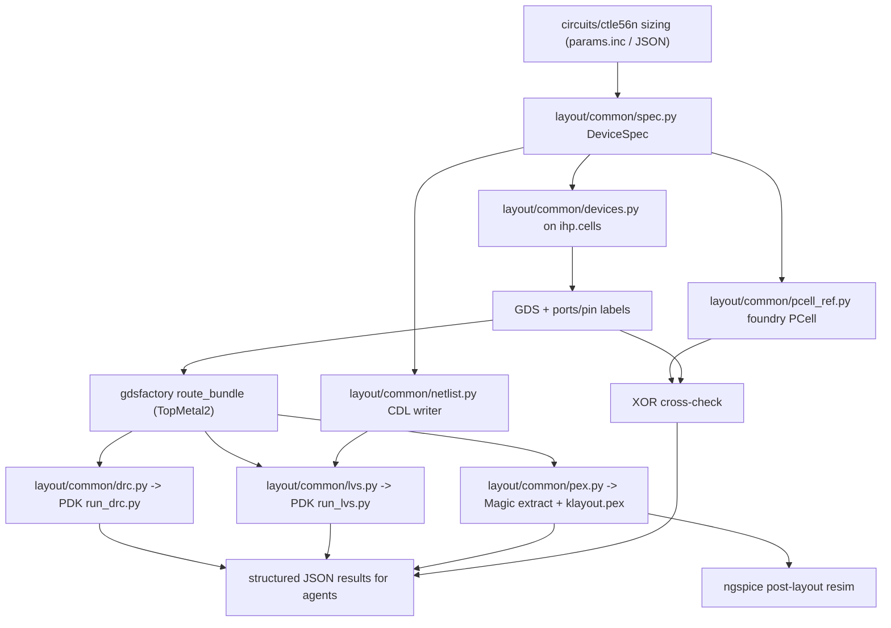

# Agentic layout flow for IHP SG13G2

**Status:** planned, not implemented. Findings below were verified against PDK commit `970a7688` (`v0.3.0-585`) and the installed toolchain as of 2026-08-19. Re-check tool versions before starting, since the PDK tracks its `dev` branch.

## What exists today

The repo is simulation-only: SPICE netlists, ngspice sweeps, and characterization LUTs. The only layout-adjacent code is [char/passive/render_layouts.py](../../char/passive/render_layouts.py), which copies PDK testcase GDS and renders PNGs. There is no layout authoring, no DRC/LVS/PEX runner, and no `layout/` directory. [docs/ENVIRONMENT.md](../../docs/ENVIRONMENT.md) explicitly lists Magic and netgen as out of scope.

The PDK is well equipped. At `$PDK_ROOT/ihp-sg13g2` there is:

- KLayout DRC deck `libs.tech/klayout/tech/drc/ihp-sg13g2.drc` (Ruby DSL, ~150 KB of rule fragments) plus a Python CLI `run_drc.py` and golden unit testcases.
- KLayout LVS deck `libs.tech/klayout/tech/lvs/sg13g2.lvs` with ~50 extraction fragments, `run_lvs.py`, and paired GDS+CDL testcases per device family.
- 36 foundry PCells in `libs.tech/klayout/python/sg13g2_pycell_lib`.
- Complete Magic tech files including `ihp-sg13g2-extract.tech` for R+C parasitic extraction, and a netgen LVS setup `libs.tech/netgen/ihp-sg13g2_setup.tcl`.
- Parasitic data: `libs.tech/parasitics/itf/sg13g2_typ.itf` (sheet R, thicknesses) and OpenRCX rules under `libs.tech/librelane/openrcx/`.

Crucially, the PDK **recommends GDSFactory for programmatic layout**. `libs.tech/gdsfactory/README.md` opens with "GDSFactory: Programmatic Layout ... AI-assisted design: generate layout code using AI tools", and the PDK README lists it under supported EDA tools. The plugin is `ihp-gdsfactory` on PyPI (2.0.0, Apache-2.0, source [gdsfactory/IHP](https://github.com/gdsfactory/IHP)), requires Python >=3.11,<3.14 (the venv is 3.12), and provides `nmos`, `pmos`, `nmos_hv`, `pmos_hv`, `rfnmos`/`rfpmos`, `npn13G2`/`npn13G2L`/`npn13G2V`, `pnpMPA`, `rsil`, `rppd`, `rhigh`, `cmim`, `rfcmim`, `cmom`, `inductor`/`inductor3`, `via_array`/`via_stack`/`via_stack_with_pads`, and `add_pads_top`. It also ships electrical cross-sections and `routing_strategies`, with `metal_routing = topmetal2_routing`, plus SPICE/VLSIR netlist export and SAX models.

## The blocking gap

The installed KLayout **binary is 0.28.16** (Ubuntu apt fallback), but the PDK pins **0.30.5** in `versions.txt` and `run_drc.py` enforces it via `check_klayout_version()`. Running the deck fails hard:

```
ERROR: In .../tech/drc/ihp-sg13g2.drc: '-': Argument needs to be a DRC layer
```

Magic and netgen are absent. apt's `magic` is 8.3.105 (the PDK tech file requires 8.3.573+) and apt's `netgen` is the unrelated mesh generator, so neither apt package is usable.

## Egress allowlist additions

With `klayout.de`/`klayout.org` allowlisted, KLayout no longer needs a from-source build: the official `.deb` can be installed exactly as the PDK's own CI does. Domains to add in the dashboard network settings:

- **`klayout.org`** and **`klayout.de`** — the PDK CI downloads `https://www.klayout.org/downloads/Ubuntu-24/klayout_${VERSION}-1_amd64.deb`; the PDK README points at `https://www.klayout.de/build.html`. Both currently fail with a connection reset.
- **`readthedocs.io`** — the official IHP PDK documentation, including the Installation Guide that the PDK README calls the required starting point (`https://ihp-open-pdk-docs.readthedocs.io/en/latest/install/installation.html`) and its "Layout with GDSFactory" chapter. Currently unreachable even from the fetch tool, so the authoritative install and layout procedure cannot be consulted while working.
- **`gdsfactory.github.io`** — the IHP GDSFactory plugin documentation (`https://gdsfactory.github.io/IHP/`), which is where the PDK's own `libs.tech/gdsfactory/README.md` sends users for installation, the cell reference, and tutorials, plus the upstream `gdsfactory` docs.
- **`opencircuitdesign.com`** — optional. This is the PDK-recommended *download* page for Magic, but pinned GitHub tags give the same versions and `github.com` is already allowlisted, so this only buys fidelity to the README.

Already allowlisted and sufficient for everything else: `github.com` and `codeload.github.com` (Magic, netgen, `gdsfactory/IHP` source), `pypi.org` and `files.pythonhosted.org` (`ihp-gdsfactory`, `gdsfactory`), `archive.ubuntu.com` (Qt/Tcl/Tk/Cairo runtime deps for the `.deb` and the Magic build).

The Cloud Agent environment for this repo is **DB-managed** (`environment-info` reports `environmentJsonPath: null`, source `Personal`), so the allowlist change is a dashboard action rather than a repo edit. Committing a `.cursor/environment.json` with `egressAllowlist` would take precedence over the personal environment and silently drop its snapshot and install configuration, so the dashboard route is the safe one.

## What already works (verified)

The `klayout` **pip module is already 0.30.5** in the venv, and the foundry PCells can be driven fully headless from it. This recipe generates a real NMOS GDS:

```python
kl = os.environ["PDK_ROOT"] + "/ihp-sg13g2/libs.tech/klayout"
sys.path[:0] = [kl+"/python", kl+"/python/pycell4klayout-api/source/python"]
import pya, sg13g2_pycell_lib
from sg13g2_pycell_lib.sg13_tech import SG13_Tech
lib = pya.Library.library_by_name("SG13_dev", SG13_Tech.TECH_NAME)   # tech arg is required
pid = ly.add_pcell_variant(lib, lib.layout().pcell_id("nmos"), {"w":"5u","l":"0.13u","ng":"2"})
```

Parameter sweeps change geometry correctly (`nmos` bbox tracks `w`/`l`/`ng`). Two quirks to encode: `library_by_name` returns `None` without the technology argument, and resistor/cap PCells ignore `l` unless `Calculate` is switched away from its default (`rppd` defaults to solving for `l`, `cmim` to `w&l`). The venv already has `gdstk`, `pandas`, `docopt`, `pyyaml`; `psutil` is missing and the PCell library warns about it.

Also relevant: KLayout 0.30.5 ships a `klayout.pex` module (`RExtractor`, `RNetwork`, `RExtractorTech`) giving **resistance-only** extraction from Python. Capacitance needs Magic's `ext2spice -C`.

## Layout authoring: GDSFactory primary, foundry PCells as reference

Use **`ihp-gdsfactory` as the authoring API**. It is the PDK's own recommendation, and it supplies what the raw PCell path lacks and what the CTLE stage needs: typed ports, hierarchical composition, `gf.routing.route_bundle`, electrical cross-sections, and netlist export.

One accuracy point drives the verification strategy: `ihp/cells/` are **independent pure-Python re-implementations** built from `add_polygon` plus design-rule constants in `ihp/tech.py`, not wrappers around the foundry PCells. So running the IHP DRC and LVS decks is not bookkeeping, it is the correctness proof. As a second line of defence, the upstream repo XOR-tests its cells against the PyCell implementations (`tests/test_xor_transistors.py`); mirror that check for the exact device sizes this repo uses, with the verified PCell recipe above as the golden reference.

## Architecture



A single `DeviceSpec` feeds the gdsfactory cell, the CDL netlist, and the PCell reference, so LVS and XOR compare views derived from one source of truth rather than hand-maintained duplicates.

---

## Stage 0 — Toolchain: make the PDK signoff decks runnable

Nothing else can be verified until this lands.

First, with the docs sites reachable, read the official [IHP PDK Installation Guide](https://ihp-open-pdk-docs.readthedocs.io/en/latest/install/installation.html) and its [Layout with GDSFactory](https://ihp-open-pdk-docs.readthedocs.io/en/latest/analog/gdsfactory.html) chapter, plus the [IHP GDSFactory plugin docs](https://gdsfactory.github.io/IHP/). The steps below were derived from the PDK's CI workflows and in-tree READMEs because those pages were unreachable; reconcile against them and prefer the documented procedure wherever it differs.

- New `scripts/install-ihp-layout.sh`, following the existing idempotent style of [scripts/install-ihp-em.sh](../../scripts/install-ihp-em.sh), and following PDK CI method for method:
  - **KLayout**: read the version from the PDK's `versions.txt` rather than hardcoding it (the PDK treats that file as the single source of truth), download `https://www.klayout.org/downloads/Ubuntu-24/klayout_${VERSION}-1_amd64.deb` with `curl -L --retry 5 --retry-all-errors`, and `apt install ./klayout_*.deb`. Fall back to the `klayout.de` mirror.
  - **Magic** pinned to `8.3.589` per `versions.txt`, **netgen** to `1.5.323`, from the PDK-listed sources (`github.com/RTimothyEdwards/{magic,netgen}`, both tags confirmed present; `opencircuitdesign.com` tarballs if that domain is allowlisted). Build deps `tcl-dev`, `tk-dev`, `libcairo2-dev`, `libx11-dev` are all in apt.
  - **GDSFactory**: `uv pip install ihp-gdsfactory==2.0.0 --no-deps` plus explicit `gdsfactory~=9.44.0`, `gplugins[sax]~=2.1.0`, `scikit-rf`. The `--no-deps` guard is deliberate: `ihp-gdsfactory` declares a hard dependency on `gdsfactoryplus`, which is licensed `PROPRIETARY AND CONFIDENTIAL`. Neither `ihp/__init__.py`, `ihp/config.py`, nor `ihp/tech.py` imports it, so the Apache-2.0 cell library should work without it. Also run the plugin's `install_tech.py` so its KLayout technology is registered.
  - Add `psutil`, `tqdm`, `termcolor`, `matplotlib` to the venv.
  - Emit `$IHP_EDA_ROOT/layout.env.sh` exporting `KLAYOUT_PATH`, the two `sg13g2_pycell_lib` Python paths, `MAGIC_RCFILE`, and `NETGEN_SETUP`.
- Update [scripts/install-ihp-eda.sh](../../scripts/install-ihp-eda.sh): the hardcoded `KLAYOUT_DEB_VERSION=0.30.3` should read `versions.txt` instead, so binary and pip module cannot drift; add a `--with-layout` flag mirroring `--with-em`.
- New `scripts/verify-ihp-layout.sh`:
  - The PDK CI **triple version check**: `klayout -b -v`, `python -c "import klayout; print(klayout.__version__)"`, and `versions.txt` must all agree.
  - Run the PDK DRC unit testcase (`tech/drc/testing/testcases/unit/activ.gds`) through `run_drc.py`.
  - Run the PDK LVS unit testcase (`sg13_lv_nmos.gds` vs `sg13_lv_nmos.cdl`) and require a clean compare.
  - Load the Magic tech headless (`magic -dnull -noconsole -rcfile $PDK_ROOT/ihp-sg13g2/libs.tech/magic/ihp-sg13g2.magicrc`) and check `netgen -batch`.
  - Import `ihp` and write an `nmos` GDS, proving the GDSFactory path works without `gdsfactoryplus`.
- Docs: new `docs/LAYOUT.md`, layout section in `docs/ENVIRONMENT.md` (the Magic/netgen "out of scope" note is now wrong), and `scripts/AGENTS.md`.

**Gate:** `./scripts/verify-ihp-layout.sh` exits 0, with matching versions, a DRC-clean and LVS-clean PDK testcase, and a GDSFactory-generated GDS.

## Stage 1 — Single-device generators + DRC

- New top-level `layout/` package with `common/`:
  - `pdk.py` — activate the `ihp` PDK (`PDK.activate()`), resolve paths, and expose the layer map from `ihp/tech.py`.
  - `spec.py` — `DeviceSpec` dataclass (device kind, geometry, terminal names) serialized to YAML/JSON.
  - `devices.py` — thin typed wrappers over `ihp.cells` (`nmos`, `rppd`, `cmim`, `npn13G2`, `via_stack`, ...) that take engineering units and return components with ports.
  - `pcell_ref.py` — the verified foundry-PCell recipe, used only to produce golden GDS for the XOR check (encodes the `library_by_name` technology argument and the `Calculate` quirk).
  - `drc.py` — invoke PDK `run_drc.py`, parse the `.lyrdb` XML into a structured JSON summary (`{rule: count, worst_items: [...]}`) so agents get machine-readable pass/fail instead of log scraping.
  - `xor.py` — XOR gdsfactory cell against PCell reference per layer, reporting residual area.
  - `render.py` — GDS to PNG, reusing the approach in `char/passive/render_layouts.py`.
- `layout/devices/gen_devices.py` CLI producing a catalog sized to match what the repo actually simulates: `rppd` 2 x 0.5 um (the CTLE load), `npn13G2` Nx=1, `sg13_lv_nmos` at L=1 um (the W=396.3 um tail, fingered), `cmim` sized for Cs=157.5 fF, plus the `char/mos` sweep corners.
- `layout/devices/run_drc.sh`; outputs under `layout/devices/out/` with `manifest.json`, `*.gds`, `*_drc.json`, `*_xor.json`, PNGs.

**Gate:** every catalog device is DRC-clean (density and antenna checks deferred, since they need surrounding context), XOR residuals against the foundry PCells are zero or explained, and everything regenerates from one script.

## Stage 2 — Single-device LVS

- `common/netlist.py` — emit CDL from the same `DeviceSpec` used for layout, matching the PDK testcase style (`MN1 D1 G1 S1 sub sg13_lv_nmos w=150.00n l=130.00n ng=1 m=1`). Cross-check against the plugin's own SPICE/VLSIR export where it covers the device.
- `common/lvs.py` — wrap PDK `run_lvs.py` with the standard options (`--ignore_top_ports_mismatch`, `--implicit_nets`), parse the report and the extracted `*_extracted.cir` into JSON, and additionally diff **extracted device parameters against intent** (W/L/ng/Nx/area) to catch silent layout-vs-netlist drift.
- Port-to-pin bridging: gdsfactory electrical ports must land as text labels on the layers the LVS deck reads (`metal1_text` is 8/25, `metal2_text` 10/25 per `rule_decks/layers_definitions.lvs`).
- `layout/devices/run_lvs.sh`.

**Gate:** all catalog devices LVS-clean with extracted parameters matching intent within tolerance.

## Stage 3 — PEX and post-layout simulation

- `common/pex.py` with two backends:
  - **Magic** (primary, gives R **and** C): GDS in via `ihp-sg13g2-GDS.tech`/cifin, then `extract` and `ext2spice` driven by a generated Tcl script, using `ihp-sg13g2-extract.tech`.
  - **`klayout.pex`** (cross-check, R only): `RExtractorTech` conductors seeded from the sheet resistances in `sg13g2_typ.itf` (`Metal1` 0.088 ohm/sq, `TopMetal1` 0.018, `TopMetal2` 0.011).
- Normalize output into a parasitic `.subckt` plus a per-net R/C report.
- Post-layout sim harness reusing the ngspice conventions in `char/` and `circuits/ctle56n/python/run_sims.py`, including the `save`-before-analysis rule from [MEMORY.md](../../MEMORY.md): resistor R schematic vs PEX, MIM C schematic vs PEX, NMOS gm/Cgs against the `char/mos` LUT.

**Gate:** PEX netlists simulate in ngspice, Magic and KLayout resistance agree within tolerance, deltas documented.

## Stage 4 — Matched sub-blocks

- `layout/blocks/` generators for the pieces the CTLE needs, composed with gdsfactory: interdigitated / common-centroid `npn13G2` differential pair, series-parallel `rppd` array realizing RD = 87.35 ohm, MIM bank for Cs = 157.5 fF, multi-finger NMOS tail with guard ring and dummies, and the degeneration resistor pair (currently ideal `R1`/`R2` in `ctle_pdk.cir`).
- Each block carries its own DRC + LVS + PEX gate and a symmetry/mismatch check on the differential pair.

**Gate:** every block DRC+LVS clean, PEX R/C within tolerance of the schematic values, load-network post-layout sim matching ideal within a documented bound.

## Stage 5 — CTLE stage layout

- `layout/blocks/ctle_stage.py` floorplans and routes the stage, driven by the sized design rather than hardcoded values: `size_ctle.py --json` already exists but is not committed, so wire that JSON in as the layout input alongside `spice/params.inc`.
- Routing uses `gf.routing.route_bundle` with the plugin's `metal_routing` cross-section, which is `topmetal2_routing` — a good default for the differential signal pairs, with `metal1`/`metal2` for local nets and a TopMetal1 supply mesh. Symmetric bundle routing for `inp`/`inn` and `outp`/`outn`.
- **Design decision to flag:** `LLOAD = 25.3 pH` has no compact PDK inductor (`MEMORY.md`: `l2n0` is ~2 nH). Options are a short TopMetal2 stub characterized with the existing openEMS EM tier, or a documented off-block placeholder with pads. Recommend the TopMetal2 stub plus EM extraction, since `char/passive/ihp_ind_em.py` already runs that flow and `ihp.cells.via_stack_with_pads`/`add_pads_top` give the pad structures.
- LVS against a CDL generated from `ctle_pdk.cir`; PEX then re-runs the existing AC/tran/eye/SBR analyses on the annotated netlist.

**Gate:** DRC+LVS clean; post-layout AC peaking, BW, and eye metrics added as a schematic-vs-post-layout comparison table in `circuits/ctle56n/ctle_report.md`.

## Stage 6 — Agentic ergonomics and regression

- New `layout/AGENTS.md` plus `layout/devices/AGENTS.md` and `layout/blocks/AGENTS.md`; update the repo map in the root [AGENTS.md](../../AGENTS.md) and `circuits/AGENTS.md`.
- Append to [MEMORY.md](../../MEMORY.md): the KLayout `versions.txt` pinning rule and the 0.28 DRC failure signature, the `--no-deps` reason for `ihp-gdsfactory`, the `library_by_name(name, tech)` argument, the PCell `Calculate` quirk, the missing `psutil` warning, and the pin-label layer numbers.
- `layout/run_all.sh` regression that regenerates everything and diffs DRC/LVS/PEX/XOR JSON against committed goldens, so an agent can detect regressions without reading logs.
- Optionally a GitHub Actions workflow (the repo has no `.github/` today), modelled on the PDK's own `drc_regression.yml` including its `.deb` caching step.

## Risks

- **`gdsfactoryplus` is proprietary.** Every published `ihp-gdsfactory` version declares it as a hard dependency. The `--no-deps` install should avoid it since no `ihp` module imports it, but this is the first thing to prove in Stage 0. If `ihp` turns out to need it at runtime, fall back to authoring on the foundry PCells (already proven working) plus plain `gdsfactory` for ports and routing.
- **Re-implemented cells versus foundry PCells.** `ihp/cells/` rebuilds device geometry from design-rule constants, so it can drift from the foundry PCells and from the DRC deck as either side is updated. Mitigated by making DRC, LVS, and the XOR-vs-PCell check hard gates on the exact sizes this repo uses.
- **Magic GDS round-trip.** Reading generated GDS into Magic for extraction can mis-map layers; if it proves unreliable, fall back to `klayout.pex` for R and analytic MIM/fringe caps for C, and record the limitation.
- **Egress dependency.** Stage 0 cannot start until `klayout.org`/`klayout.de` are allowlisted; without them the only route back is a from-source KLayout build (feasible via `codeload.github.com`, but on a 4-core VM it is the long pole and drags in Qt build dependencies).
- **Install steps derived from secondary sources.** Because `readthedocs.io` and `gdsfactory.github.io` are currently blocked, the Stage 0 procedure comes from the PDK's `drc_regression.yml`, in-tree READMEs, and `versions.txt` rather than the official guides. Once those domains are allowlisted, re-read both and correct any divergence before building on top of Stage 0.
