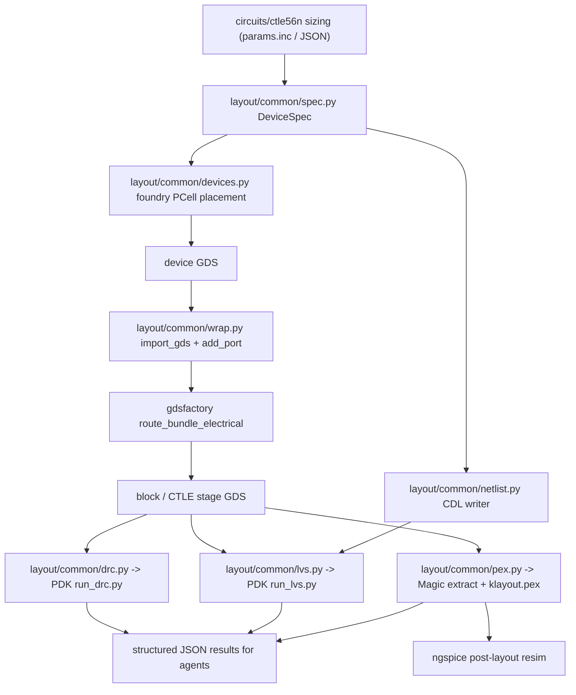

# Agentic layout flow for IHP SG13G2

**Status:** planned, not implemented. Findings below were verified against PDK commit `970a7688` (`v0.3.0-585`) and the installed toolchain as of 2026-08-19; circuit values were refreshed against `main` at `f3431be`. Re-check both before starting, since the PDK tracks its `dev` branch and the front end is under active design.

Device facts, model names, the metal stack, and known traps live in [docs/PDK.md](../../docs/PDK.md) and [MEMORY.md](../../MEMORY.md). This plan defers to them rather than restating them, and Stage 6 diffs against them rather than duplicating.

## What exists today

The repo is simulation-only: SPICE netlists, ngspice sweeps, and characterization LUTs. `circuits/ctle56n/` is now a full 56 Gb/s NRZ RX front end — 50 ohm/ESD termination, CML CTLE, current-steering VGA, pad driver, and a combined chain — not a single CTLE stage. The only layout-adjacent code is [char/passive/render_layouts.py](../../char/passive/render_layouts.py), which copies PDK testcase GDS and renders PNGs, plus the EM inductor work in `char/passive/` that already generates coil GDS for openEMS. There is no layout authoring, no DRC/LVS/PEX runner, and no `layout/` directory. [docs/ENVIRONMENT.md](../../docs/ENVIRONMENT.md) still lists Magic and netgen as out of scope.

Scope note: this plan targets **single devices through the CTLE stage**. Termination, VGA, driver, and the full chain reuse the same machinery and follow once the CTLE stage closes.

The PDK is well equipped. At `$PDK_ROOT/ihp-sg13g2` there is:

- KLayout DRC deck `libs.tech/klayout/tech/drc/ihp-sg13g2.drc` (Ruby DSL, ~150 KB of rule fragments) plus a Python CLI `run_drc.py` and golden unit testcases.
- KLayout LVS deck `libs.tech/klayout/tech/lvs/sg13g2.lvs` with ~50 extraction fragments, `run_lvs.py`, and paired GDS+CDL testcases per device family.
- 36 foundry PCells in `libs.tech/klayout/python/sg13g2_pycell_lib`: `nmos`, `nmosHV`, `pmos`, `pmosHV`, `rfnmos`/`rfpmos` (+HV), `npn13G2`/`npn13G2L`/`npn13G2V`, `pnpMPA`, `rsil`, `rppd`, `rhigh`, `cmim`, `rfcmim`, `cmomi`, `cmomf`, `moscap_n`/`moscap_p`, `SVaricap`, `inductor2`, `inductor3`, `ntap1`, `ptap1`, `via_stack`, `bondpad`, `sealring`, `esd`, `dantenna`, `dpantenna`, `schottky`, `isolbox`, `NoFillerStack`.
- Complete Magic tech files including `ihp-sg13g2-extract.tech` for R+C parasitic extraction, and a netgen LVS setup `libs.tech/netgen/ihp-sg13g2_setup.tcl`.
- Parasitic data: `libs.tech/parasitics/itf/sg13g2_typ.itf` (sheet R, thicknesses) and OpenRCX rules under `libs.tech/librelane/openrcx/`.

The PDK also **recommends GDSFactory for programmatic layout**. `libs.tech/gdsfactory/README.md` is titled "GDSFactory: Programmatic Layout" and cites AI-assisted design; the PDK README lists it under supported EDA tools.

## The blocking gap

The installed KLayout **binary is 0.28.16** (Ubuntu apt fallback), but the PDK pins **0.30.5** in `versions.txt` and `run_drc.py` enforces it via `check_klayout_version()`. Running the deck fails hard:

```
ERROR: In .../tech/drc/ihp-sg13g2.drc: '-': Argument needs to be a DRC layer
```

Magic and netgen are absent. apt's `magic` is 8.3.105 (the PDK tech file requires 8.3.573+) and apt's `netgen` is the unrelated mesh generator, so neither apt package is usable.

## Egress allowlist additions

With `klayout.de`/`klayout.org` allowlisted, KLayout no longer needs a from-source build: the official `.deb` can be installed exactly as the PDK's own CI does. Domains to add in the dashboard network settings:

- **`klayout.org`** and **`klayout.de`** — the PDK CI downloads `https://www.klayout.org/downloads/Ubuntu-24/klayout_${VERSION}-1_amd64.deb`; the PDK README points at `https://www.klayout.de/build.html`. Both currently fail with a connection reset.
- **`readthedocs.io`** — the official IHP PDK documentation, including the Installation Guide that the PDK README calls the required starting point (`https://ihp-open-pdk-docs.readthedocs.io/en/latest/install/installation.html`) and its "Layout with GDSFactory" chapter. Currently unreachable even from the fetch tool, so the authoritative install and layout procedure cannot be consulted while working.
- **`gdsfactory.github.io`** — the upstream `gdsfactory` documentation, needed for the routing API, plus the IHP plugin docs (`https://gdsfactory.github.io/IHP/`) that the PDK's own `libs.tech/gdsfactory/README.md` points to.
- **`opencircuitdesign.com`** — optional. This is the PDK-recommended *download* page for Magic, but pinned GitHub tags give the same versions and `github.com` is already allowlisted, so this only buys fidelity to the README.

Already allowlisted and sufficient for everything else: `github.com` and `codeload.github.com` (Magic, netgen source), `pypi.org` and `files.pythonhosted.org` (`gdsfactory`), `archive.ubuntu.com` (Qt/Tcl/Tk/Cairo runtime deps for the `.deb` and the Magic build).

The Cloud Agent environment for this repo is **DB-managed** (`environment-info` reports `environmentJsonPath: null`, source `Personal`), so the allowlist change is a dashboard action rather than a repo edit. Committing a `.cursor/environment.json` with `egressAllowlist` would take precedence over the personal environment and silently drop its snapshot and install configuration, so the dashboard route is the safe one.

## What already works (verified)

The `klayout` **pip module is already 0.30.5** in the venv, and the foundry PCells can be driven fully headless from it. This recipe generates a real NMOS GDS:

```python
kl = os.environ["PDK_ROOT"] + "/ihp-sg13g2/libs.tech/klayout"
sys.path[:0] = [kl+"/python", kl+"/python/pycell4klayout-api/source/python"]
import pya, sg13g2_pycell_lib
from sg13g2_pycell_lib.sg13_tech import SG13_Tech
lib = pya.Library.library_by_name("SG13_dev", SG13_Tech.TECH_NAME)   # tech arg is required
pid = ly.add_pcell_variant(lib, lib.layout().pcell_id("nmos"), {"w":"5u","l":"0.13u","ng":"2"})
```

Parameter sweeps change geometry correctly (`nmos` bbox tracks `w`/`l`/`ng`). Two quirks to encode: `library_by_name` returns `None` without the technology argument, and resistor/cap PCells ignore `l` unless `Calculate` is switched away from its default (`rppd` defaults to solving for `l`, `cmim` to `w&l`). The venv already has `gdstk`, `pandas`, `docopt`, `pyyaml`; `psutil` is missing and the PCell library warns about it.

Also relevant: KLayout 0.30.5 ships a `klayout.pex` module (`RExtractor`, `RNetwork`, `RExtractorTech`) giving **resistance-only** extraction from Python. Capacitance needs Magic's `ext2spice -C`.

## Layout authoring: foundry PCells for placement, GDSFactory for routing

**Devices come from the foundry PCells; GDSFactory is used only for composition and electrical routing.**

This is deliberate. The alternative was to author devices with the `ihp-gdsfactory` plugin, but its `ihp/cells/` are **independent pure-Python re-implementations** built from `add_polygon` plus design-rule constants in `ihp/tech.py`, not wrappers around the foundry PCells. The PCells are the authoritative geometry, are what the LVS deck's device extraction is written against, and already work headless here, so placing them directly removes a whole class of drift between our layout and the foundry's intent.

On the `gdsfactoryplus` question, checked against the published wheel rather than the metadata summary: `ihp-gdsfactory` 2.0.0 declares `Requires-Dist: gdsfactoryplus` (licensed `PROPRIETARY AND CONFIDENTIAL`), but a scan of all 198 files in the wheel finds the string `gdsfactoryplus` **only inside `dist-info/METADATA`** and in no Python, YAML, JSON, or data file. Nothing in the package imports it, so it is a packaging-level declaration only and `--no-deps` sidesteps it cleanly. That means the plugin is *usable* without a subscription — but under this plan it is no longer on the critical path either way.

The routing half is verified against the `gdsfactory` 9.44.0 wheel. Everything the hybrid needs is present in the Apache-2.0 package:

- `gdsfactory.read.import_gds` to bring a PCell-generated GDS in as a `Component`.
- `Component.add_port(name=, center=, width=, orientation=, layer=, port_type=)` to annotate device terminals, including `port_type="electrical"`.
- `gdsfactory.routing.route_bundle_electrical` and `route_single_electrical`, plus `route_bundle(..., port_type=, cross_section=, layer=, bboxes=, waypoints=, collision_check_layers=)` for obstacle-aware bundles, and `wire_corner` for right-angle metal corners.

Cross-sections for the metal stack are the one piece we do not get for free. Two options, to be settled by the Stage 0 spike: take `LAYER`, `LAYER_STACK`, and the electrical cross-sections from the plugin's Apache-2.0 `ihp/tech.py` (installed `--no-deps`, using nothing else from it), or define our own from the layer numbers in `tech/sg13g2.lyt`. The first is much less work and is the PDK-endorsed layer map; the second removes the dependency entirely.

## Architecture



A single `DeviceSpec` feeds both the PCell parameters and the CDL netlist, so LVS compares two views derived from one source of truth rather than two hand-maintained files.

---

## Stage 0 — Toolchain: make the PDK signoff decks runnable

Nothing else can be verified until this lands.

First, with the docs sites reachable, read the official [IHP PDK Installation Guide](https://ihp-open-pdk-docs.readthedocs.io/en/latest/install/installation.html) and its [Layout with GDSFactory](https://ihp-open-pdk-docs.readthedocs.io/en/latest/analog/gdsfactory.html) chapter, plus the [gdsfactory docs](https://gdsfactory.github.io/gdsfactory/). The steps below were derived from the PDK's CI workflows and in-tree READMEs because those pages were unreachable; reconcile against them and prefer the documented procedure wherever it differs.

- New `scripts/install-ihp-layout.sh`, following the existing idempotent style of [scripts/install-ihp-em.sh](../../scripts/install-ihp-em.sh), and following PDK CI method for method:
  - **KLayout**: read the version from the PDK's `versions.txt` rather than hardcoding it (the PDK treats that file as the single source of truth), download `https://www.klayout.org/downloads/Ubuntu-24/klayout_${VERSION}-1_amd64.deb` with `curl -L --retry 5 --retry-all-errors`, and `apt install ./klayout_*.deb`. Fall back to the `klayout.de` mirror.
  - **Magic** pinned to `8.3.589` per `versions.txt`, **netgen** to `1.5.323`, from the PDK-listed sources (`github.com/RTimothyEdwards/{magic,netgen}`, both tags confirmed present; `opencircuitdesign.com` tarballs if that domain is allowlisted). Build deps `tcl-dev`, `tk-dev`, `libcairo2-dev`, `libx11-dev` are all in apt.
  - **GDSFactory**: plain `gdsfactory~=9.44.0` from PyPI, for routing and composition only. Optionally `ihp-gdsfactory==2.0.0 --no-deps` if the spike concludes we want its `ihp/tech.py` layer map and cross-sections; nothing else from the plugin is used, and `--no-deps` keeps `gdsfactoryplus` out.
  - Add `psutil`, `tqdm`, `termcolor`, `matplotlib` to the venv.
  - Emit `$IHP_EDA_ROOT/layout.env.sh` exporting `KLAYOUT_PATH`, the two `sg13g2_pycell_lib` Python paths, `MAGIC_RCFILE`, and `NETGEN_SETUP`.
- Update [scripts/install-ihp-eda.sh](../../scripts/install-ihp-eda.sh): the hardcoded `KLAYOUT_DEB_VERSION=0.30.3` should read `versions.txt` instead, so binary and pip module cannot drift; add a `--with-layout` flag mirroring `--with-em`.
- **Routing spike** — the one genuinely unproven step, so do it before writing any generator code. On a single `nmos`: emit the PCell GDS, `import_gds` it, `add_port` its gate/drain/source terminals as electrical ports, place two instances, and `route_bundle_electrical` between them on a Metal1/Metal2 cross-section. Confirm the result is DRC-clean and that the routing metal actually connects (LVS on the two-device cell). Decide the cross-section question here.
- New `scripts/verify-ihp-layout.sh`:
  - The PDK CI **triple version check**: `klayout -b -v`, `python -c "import klayout; print(klayout.__version__)"`, and `versions.txt` must all agree.
  - Run the PDK DRC unit testcase (`tech/drc/testing/testcases/unit/activ.gds`) through `run_drc.py`.
  - Run the PDK LVS unit testcase (`sg13_lv_nmos.gds` vs `sg13_lv_nmos.cdl`) and require a clean compare.
  - Load the Magic tech headless (`magic -dnull -noconsole -rcfile $PDK_ROOT/ihp-sg13g2/libs.tech/magic/ihp-sg13g2.magicrc`) and check `netgen -batch`.
  - Re-run the routing spike as a smoke test.
- Docs: new `docs/LAYOUT.md`, layout section in `docs/ENVIRONMENT.md` (the Magic/netgen "out of scope" note is now wrong), and `scripts/AGENTS.md`.

**Gate:** `./scripts/verify-ihp-layout.sh` exits 0, with matching versions, a DRC-clean and LVS-clean PDK testcase, and a routed two-device cell.

## Stage 1 — Single-device generators + DRC

- New top-level `layout/` package with `common/`:
  - `pdk.py` — headless PCell bootstrap (the verified recipe above), plus the gdsfactory `Pdk` registration and cross-sections chosen in Stage 0.
  - `spec.py` — `DeviceSpec` dataclass (device kind, geometry, terminal names) serialized to YAML/JSON.
  - `devices.py` — typed wrappers around the foundry PCells taking engineering units: `nmos`, `pmos`, `rppd`, `rsil`, `rhigh`, `cmim`, `npn13G2`, `ntap1`/`ptap1`, `via_stack`. Encodes the `Calculate` quirk so `w`/`l` are honoured.
  - `wrap.py` — the PCell-to-gdsfactory bridge: `import_gds` the device, then attach named electrical ports from a per-device terminal table so blocks can be composed and routed. This table is the main piece of hand-written knowledge in the flow, so it gets its own tests.
  - `drc.py` — invoke PDK `run_drc.py`, parse the `.lyrdb` XML into a structured JSON summary (`{rule: count, worst_items: [...]}`) so agents get machine-readable pass/fail instead of log scraping.
  - `render.py` — GDS to PNG, reusing the approach in `char/passive/render_layouts.py`.
- `layout/devices/gen_devices.py` CLI producing a catalog sized to match what the front end actually instantiates today (from `circuits/ctle56n/spice/params.inc`, which is generated and committed, so read it rather than hardcoding):
  - `rppd` w=5 um, l=1.4 um — CTLE shunt-peaked load, 86.74 ohm realized
  - `rsil` w=0.5 um, l=5 um — CTLE degeneration (also termination and driver load)
  - `cmomi` w=l=12.43 um with `feed=same` — degeneration cap, 183.7 fF
  - `npn13G2` Nx=1 — differential pair
  - `nmos` L=1 um, W=242.99 um total, fingered — tail and mirror
  - `cmim` — termination decap
  - `inductor` (Magic `inductor2`) at the EM-characterized `turn1_d40` geometry: 1 turn, d=40 um, w=4 um, s=2.1 um, TopMetal2
  - `ntap1`/`ptap1`, `via_stack`, `bondpad` — guard rings, stacks, pads
  - plus the `char/mos` sweep corners
  The ESD devices in the termination stage (`diodevdd_2kv`, `diodevss_2kv`, `nmoscl_2`) are PDK cells rather than PCells and are deferred with the termination stage.
- `layout/devices/run_drc.sh`; outputs under `layout/devices/out/` with `manifest.json`, `*.gds`, `*_drc.json`, PNGs.

**Gate:** every catalog device is DRC-clean (density and antenna checks deferred, since they need surrounding context), every device exposes correctly placed electrical ports, and everything regenerates from one script.

## Stage 2 — Single-device LVS

- `common/netlist.py` — emit CDL from the same `DeviceSpec` used for layout, matching the PDK testcase style (`MN1 D1 G1 S1 sub sg13_lv_nmos w=150.00n l=130.00n ng=1 m=1`).
- `common/lvs.py` — wrap PDK `run_lvs.py` with the standard options (`--ignore_top_ports_mismatch`, `--implicit_nets`), parse the report and the extracted `*_extracted.cir` into JSON, and additionally diff **extracted device parameters against intent** (W/L/ng/Nx/area) to catch silent layout-vs-netlist drift.
- Port-to-pin bridging is the crux of this stage: the electrical ports added in `wrap.py` must materialize as text labels on the layers the LVS deck reads (`metal1_text` is 8/25, `metal2_text` 10/25 per `rule_decks/layers_definitions.lvs`). Verify per device that extracted net names match the CDL terminals.
- `layout/devices/run_lvs.sh`.

**Gate:** all catalog devices LVS-clean with extracted parameters matching intent within tolerance.

## Stage 3 — PEX and post-layout simulation

- `common/pex.py` with two backends:
  - **Magic** (primary, gives R **and** C): GDS in via `ihp-sg13g2-GDS.tech`/cifin, then `extract` and `ext2spice` driven by a generated Tcl script, using `ihp-sg13g2-extract.tech`.
  - **`klayout.pex`** (cross-check, R only): `RExtractorTech` conductors seeded from the sheet resistances already tabulated in [docs/PDK.md](../../docs/PDK.md) (`Metal1` 0.110 ohm/sq, `Metal2`-`Metal5` 0.088, `TopMetal1` 0.018, `TopMetal2` 0.011), sourced from `sg13g2_typ.itf` and `res_extraction.lvs`.
- Normalize output into a parasitic `.subckt` plus a per-net R/C report.
- Post-layout sim harness reusing the ngspice conventions in `char/` and `circuits/ctle56n/python/run_sims.py`, including the `save`-before-analysis rule from [MEMORY.md](../../MEMORY.md): resistor R schematic vs PEX, MIM C schematic vs PEX, NMOS gm/Cgs against the `char/mos` LUT.

**Gate:** PEX netlists simulate in ngspice, Magic and KLayout resistance agree within tolerance, deltas documented.

## Stage 4 — Matched sub-blocks

- `layout/blocks/` generators for the pieces the CTLE stage needs, placing PCells and routing with gdsfactory: interdigitated / common-centroid `npn13G2` differential pair, the `rppd` load pair at 86.74 ohm, the `cmomi` degeneration cap at 183.7 fF, the `rsil` degeneration resistor, and the tail plus mirror as a fingered `nmos` array with `ntap1`/`ptap1` guard ring and dummies. Note the current topology uses **two tail devices** (`Xtail1`/`Xtail2`, one per emitter node), not a single shared tail.
- The shunt-peaking coil is its own block: the `inductor` PCell at the `turn1_d40` geometry. Its layout must be reconciled against the synthesized octagon GDS that `char/passive/` fed to openEMS, since the fitted `ind_shunt` model the PDK netlist uses was extracted from that geometry, not from the PCell.
- Each block carries its own DRC + LVS + PEX gate and a symmetry/mismatch check on the differential pair.

**Gate:** every block DRC+LVS clean, PEX R/C within tolerance of the schematic values, load-network post-layout sim matching ideal within a documented bound.

## Stage 5 — CTLE stage layout

- `layout/blocks/ctle_stage.py` floorplans and routes the stage, driven by the sized design rather than hardcoded values: `size_ctle.py --json` already exists but is not committed, so wire that JSON in as the layout input alongside `spice/params.inc`.
- Routing with `route_bundle_electrical` on a TopMetal2 cross-section for the differential signal pairs, `metal1`/`metal2` for local nets, and a TopMetal1 supply mesh. Symmetric bundle routing for `inp`/`inn` and `outp`/`outn`; use `bboxes` to keep bundles off the devices.
- **The inductor is already settled, and that changes this stage's job.** The PDK pass no longer uses an ideal `L`: it instantiates `ind_shunt`, an EM-fitted lumped pi-model in `spice/ind_shunt.inc` extracted from a 1-turn TopMetal2 octagon at d=40 um, w=4 um, s=2.1 um, giving ~66 pH at 28 GHz. So the layout task is to build that specific coil rather than to choose a strategy. Two things to get right, both already documented in [MEMORY.md](../../MEMORY.md): the `inductor` PCell has `dmin = 25.35 um` so ~39 pH is the floor, and the coil's ~5.8 fF port capacitance sits on the internal `nlp` node where it resonates with `L`, so it must stay out of the `C_L` budget. PEX on the laid-out coil then becomes a direct cross-check against the EM fit.
- LVS against a CDL generated from `ctle_pdk.cir`, which now instantiates `rppd`, `rsil`, `cap_cmomi`, `npn13G2`, `sg13_lv_nmos`, and `ind_shunt`. The coil needs an LVS story of its own, since `inductor` is a layout/LVS-only device with no ngspice model: compare against the PCell device rather than the fitted subcircuit.
- PEX then re-runs the existing AC/tran/eye/SBR analyses on the annotated netlist via `ctlelib`, and `generate_reports.py` already produces the stage report this should extend.

**Gate:** DRC+LVS clean; post-layout AC peaking, BW, and eye metrics added as a schematic-vs-post-layout comparison table in `circuits/ctle56n/ctle_report.md`.

## Stage 6 — Agentic ergonomics and regression

- New `layout/AGENTS.md` plus `layout/devices/AGENTS.md` and `layout/blocks/AGENTS.md`; update the repo map in the root [AGENTS.md](../../AGENTS.md) (which already lists `.cursor/plans/`), `circuits/AGENTS.md`, and `docs/AGENTS.md` when `docs/LAYOUT.md` lands.
- Diff against [MEMORY.md](../../MEMORY.md) and [docs/PDK.md](../../docs/PDK.md) before writing, since both are already extensive; add only what is genuinely new. Candidates: the KLayout `versions.txt` pinning rule and the 0.28 DRC failure signature, the `library_by_name(name, tech)` argument, the PCell `Calculate` quirk, the missing `psutil` warning, the pin-label layer numbers, and the PCell-placement / gdsfactory-routing split. Layout-relevant device facts belong in `docs/PDK.md` instead.
- `layout/run_all.sh` regression that regenerates everything and diffs DRC/LVS/PEX JSON against committed goldens, so an agent can detect regressions without reading logs.
- Optionally a GitHub Actions workflow (the repo has no `.github/` today), modelled on the PDK's own `drc_regression.yml` including its `.deb` caching step.

## Risks

- **Hand-maintained terminal tables.** Foundry PCells expose geometry, not gdsfactory ports, so `wrap.py` carries a per-device table of terminal positions, widths, and layers. This is the most likely source of silent breakage and the reason LVS is a hard gate from Stage 2 onward rather than a later nicety. Derive positions from the PCell's own pin shapes where possible instead of hardcoding coordinates.
- **Routing spike is unproven.** `import_gds` + `add_port` + `route_bundle_electrical` all exist in the `gdsfactory` 9.44.0 wheel, but the combination has not been run against a PCell here. It is the first Stage 0 task for that reason; if electrical bundle routing proves awkward on this stack, the fallback is KLayout-native path building on explicit waypoints, keeping gdsfactory for hierarchy only.
- **Magic GDS round-trip.** Reading generated GDS into Magic for extraction can mis-map layers; if it proves unreliable, fall back to `klayout.pex` for R and analytic caps for C. In that case use the `defaultareacap` table in [docs/PDK.md](../../docs/PDK.md) and heed its warning that those values are **aF/um^2, not fF/um^2**, and that area capacitance alone badly underestimates a narrow signal wire.
- **Egress dependency.** Stage 0 cannot start until `klayout.org`/`klayout.de` are allowlisted; without them the only route back is a from-source KLayout build (feasible via `codeload.github.com`, but on a 4-core VM it is the long pole and drags in Qt build dependencies).
- **Install steps derived from secondary sources.** Because `readthedocs.io` and `gdsfactory.github.io` are currently blocked, the Stage 0 procedure comes from the PDK's `drc_regression.yml`, in-tree READMEs, and `versions.txt` rather than the official guides. Once those domains are allowlisted, re-read both and correct any divergence before building on top of Stage 0.
