# IHP SG13G2 passive device characterization

DC / AC SPICE LUTs for resistors and capacitors, plus optional **openEMS** inductor
characterization. Archives use `char.common.lut` (`.npz` + JSON metadata) so MOS / BJT /
passive tables load the same way.

## Device matrix

| Class | Models / cases | Sweep axes | Solver |
| --- | --- | --- | --- |
| **Resistors** | `rsil`, `rppd`, `rhigh` | W × L × T (−40 / 27 / 125 °C) | ngspice DC |
| **Capacitors** | `cap_cmim`, `cap_cmomi`, `sg13_moscap_n`, `sg13_moscap_p` | geometry; MOSCAP also V | ngspice AC @ 100 MHz |
| **Inductors** | `l2n0`, `turn1`, `turn1_d40` … `turn1_d80`, `turn2` | L(f), Q(f); small cases to 100 GHz | openEMS (primary) |

### Inductor cases

| Case | Geometry | f\_stop | Status |
| --- | --- | --- | --- |
| `l2n0` | Canonical PDK smoke GDS (`L_2n0_twoport.gds`) | 30 GHz | **Validated** — L ≈ 2 nH @ 10 GHz |
| `turn1` | 1-turn synthesized octagon, d=120 µm (TopMetal2) | 30 GHz | **Experimental** — plausible |
| `turn1_d40` | 1-turn octagon, d=40 µm, w=4 µm, s=2.1 µm (TopMetal2) | 100 GHz | Small coil — CTLE shunt peaking |
| `turn1_d60` | 1-turn octagon, d=60 µm | 100 GHz | Small coil — CTLE shunt peaking |
| `turn1_d80` | 1-turn octagon, d=80 µm | 100 GHz | Small coil — CTLE shunt peaking |
| `turn2` | 2-turn synthesized octagon (TopMetal1) | 30 GHz | **Invalid** — negative L, Q=0 |

Beyond `L(f)`/`Q(f)`, the inductor flow extracts a full 2-port pi-model from the EM Touchstone
(series impedance, per-port capacitance and conductance) and persists it — along with a downsampled
S-matrix — into the committed `.npz`, since `out/em_work/` is gitignored. The lumped SPICE model built
from it is then verified against the EM data in S-parameter space using ngspice `sp` analysis; see
`ind_sp_validate_summary.csv` and the per-case `ind_sp_validate_*.png` overlays. `Q(f)` is not usable
for these small coils on its own (65 pH at 10 GHz is only ~4 Ω of reactance, so the extracted `Q` swings
wildly), which is why the pi-model route exists.

`ind_summary.csv` includes `valid` and `invalid_reason` so broken EM runs (e.g. `turn2`) are
not mistaken for usable data. Regenerate with `summarize_ind.py` after any `.npz` change.

Committed artifacts under `char/passive/out/` include `.npz`, `.meta.json`, `*_summary.csv`,
and PNG plots. Transient openEMS working files live in `out/em_work/` (gitignored).

## EM toolchain

Inductor sweeps need the optional EM tier:

```bash
./scripts/install-ihp-eda.sh --with-em
# or: ./scripts/install-ihp-em.sh
source ~/.local/share/ihp-eda/env.sh
./scripts/verify-ihp-em.sh
```

| Tier | When to use | Notes |
| --- | --- | --- |
| **openEMS** | **Primary** on ~16 GB hosts | Built by `install-ihp-em.sh`; Python workflow under `$PDK_ROOT/.../openems_ihp_sg13g2/workflow` |
| **Palace** | Optional FEM on large hosts | ≥32 GB RAM + Apptainer; pulled only when MemTotal ≥28 GB |

Headless runs skip the AppCSXCAD GUI; the installer provides a no-op stub at
`$IHP_EDA_ROOT/tools/bin/AppCSXCAD` (see [docs/APPCSXCAD-STUB.md](../../docs/APPCSXCAD-STUB.md)).

## Run

```bash
source ~/.local/share/ihp-eda/env.sh

# Full passive suite (R → C → L)
./char/passive/run_all.sh

# Skip openEMS; re-summarize existing inductor .npz only
./char/passive/run_all.sh --skip-em

# Per class
./char/passive/run_res.sh
./char/passive/run_cap.sh
./char/passive/run_ind.sh
./char/passive/run_ind.sh --skip-em

# Subset / quick grids (passed through to Python sweep scripts)
./char/passive/run_res.sh --quick
./char/passive/run_ind.sh --cases l2n0
```

Via parent orchestrator (MOS + BJT + passives):

```bash
./char/run_all.sh
./char/run_all.sh --skip-em   # passives skip EM only
```

## Outputs (`char/passive/out/`)

| Pattern | Contents |
| --- | --- |
| `sg13_{model}.npz` / `.meta.json` | Resistor LUTs (`rsil`, `rppd`, `rhigh`) |
| `sg13_cap_*.npz`, `sg13_moscap_*.npz` | Capacitor LUTs |
| `sg13_ind_{case}.npz` | Inductor L(f), Q(f) |
| `res_summary.csv`, `cap_summary.csv`, `ind_summary.csv` | Human-readable tables |
| `res_*.png`, `cap_*.png`, `ind_*_LQ.png` | Summary plots |

Agent contracts: [`AGENTS.md`](AGENTS.md). Shared LUT I/O: [`../common/lut.py`](../common/lut.py).

## Layouts

Batch layout screenshots (GDS → PNG) for passive device geometries used in the
characterization sweeps. Regenerate with:

```bash
source ~/.local/share/ihp-eda/env.sh
./char/passive/run_render_layouts.sh
```

Outputs land in `char/passive/out/layouts/` (PNG) and `char/passive/out/layouts/gds/` (copied or
synthesized GDS for reproducibility).

### Capacitors

| Layout | Description |
| --- | --- |
| 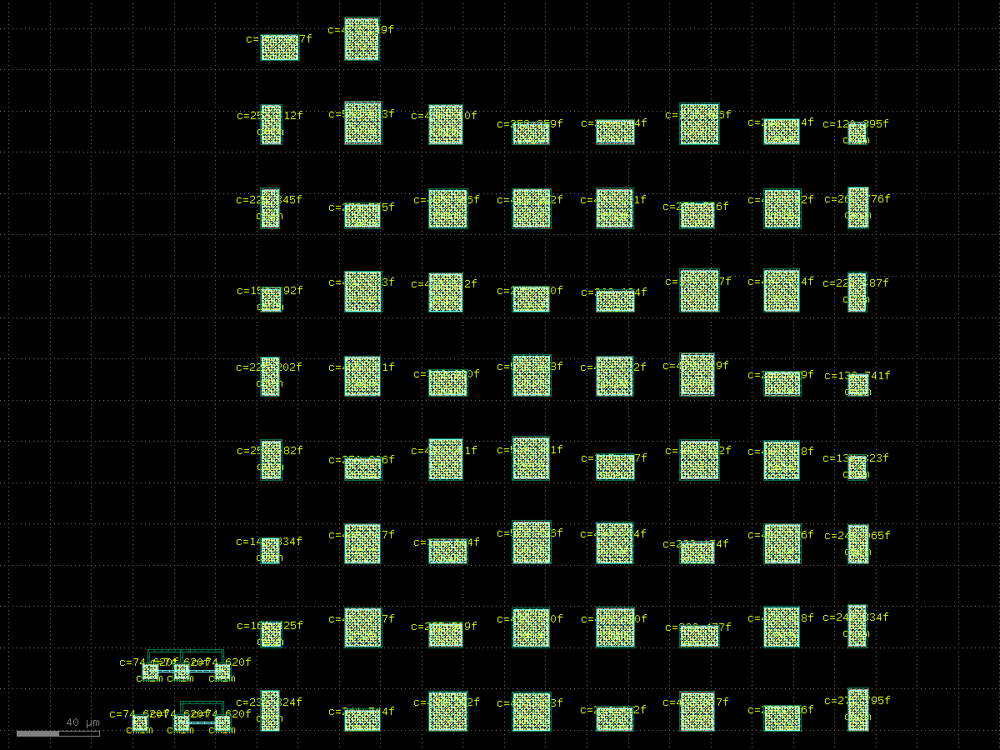 | PDK `cap_cmim` testcase |
| 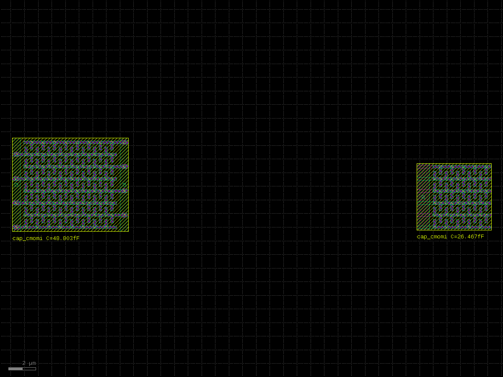 | Interdigitated `cap_cmomi` |
| 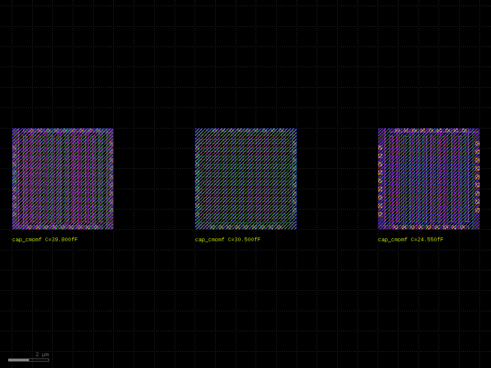 | Finger `cap_cmomf` |
| 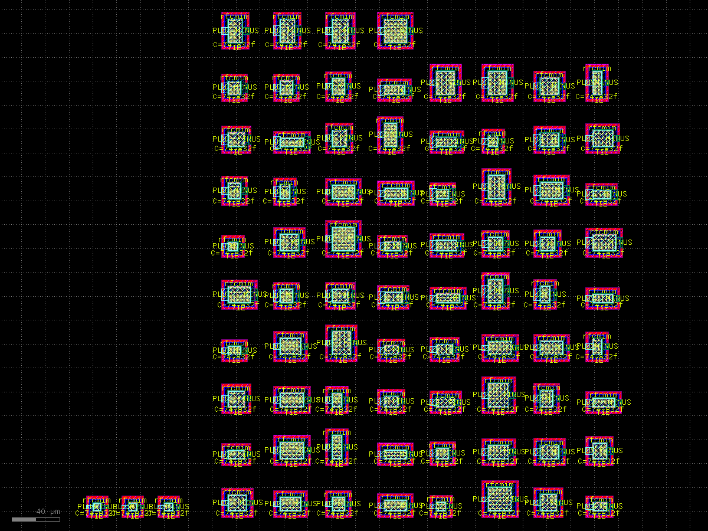 | RF MIM testcase |
| 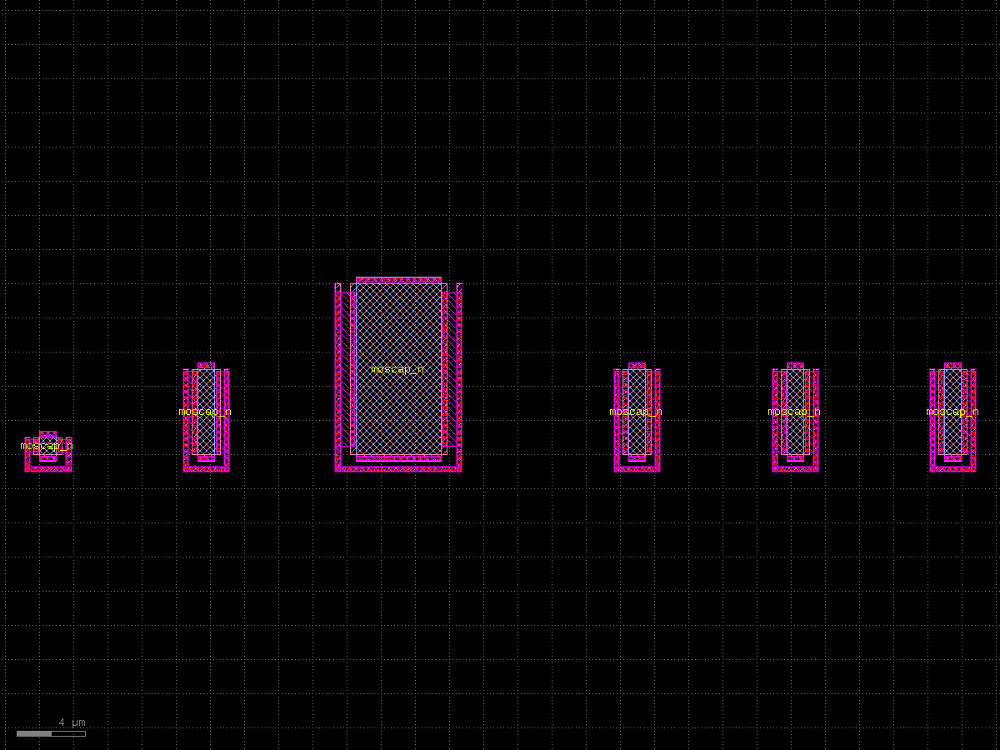 | `sg13_moscap_n` |
| 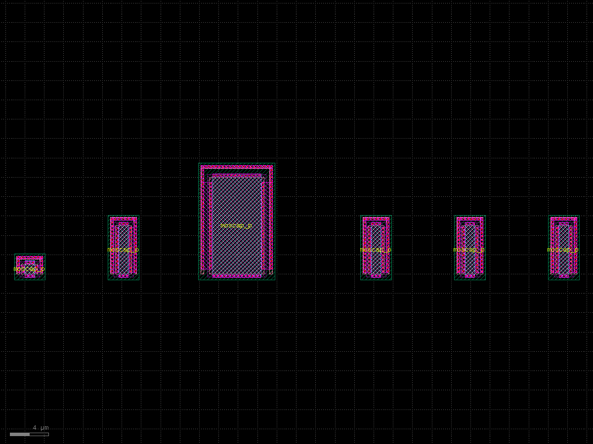 | `sg13_moscap_p` |
| 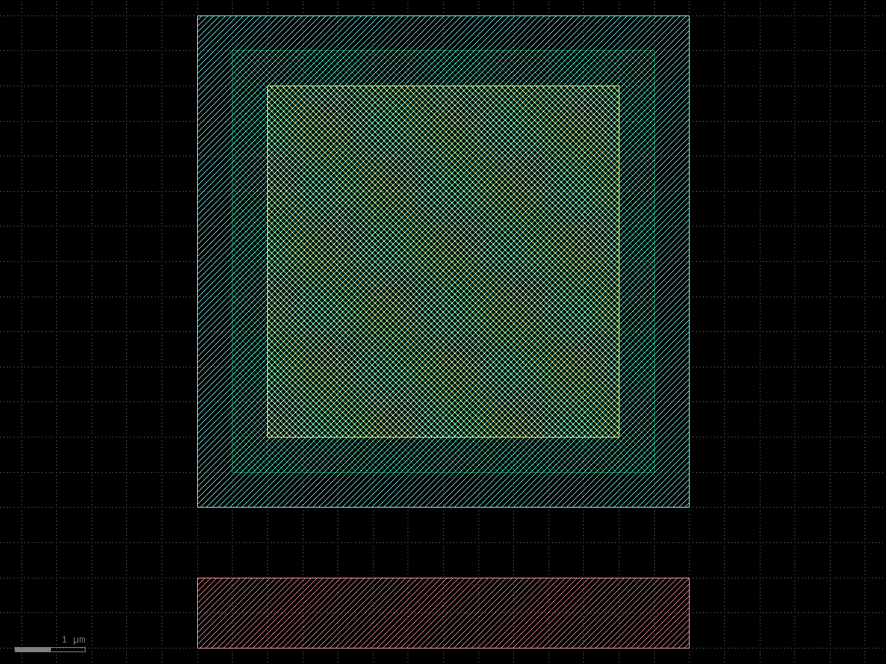 | Educational MIM 7×7 µm (char LUT size) |
| 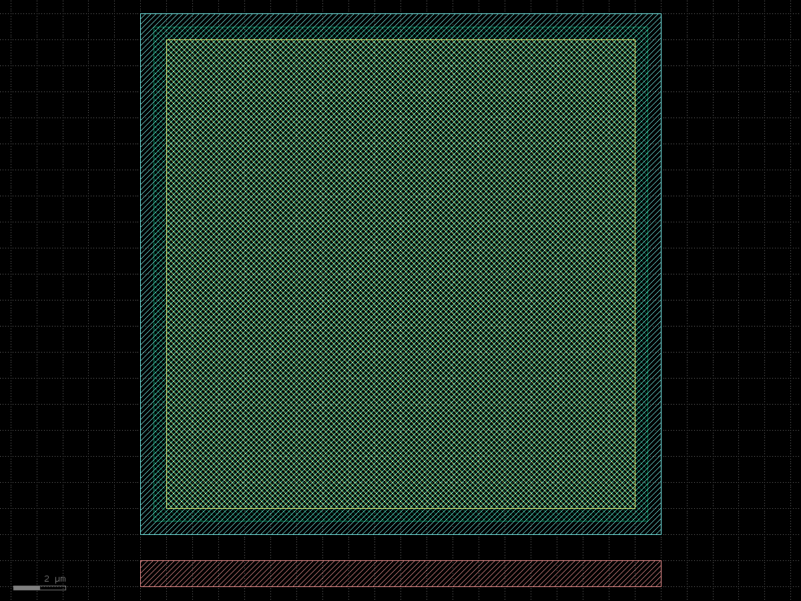 | Educational MIM 20×20 µm (char LUT size) |

### Inductors

| Layout | Description |
| --- | --- |
| 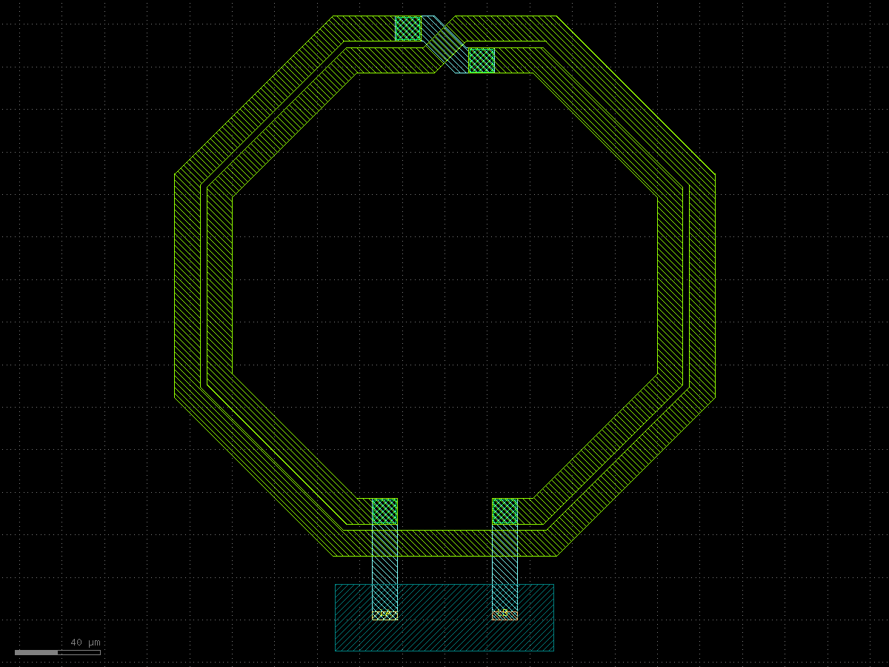 | Canonical `L_2n0_twoport` (openEMS smoke) |
| 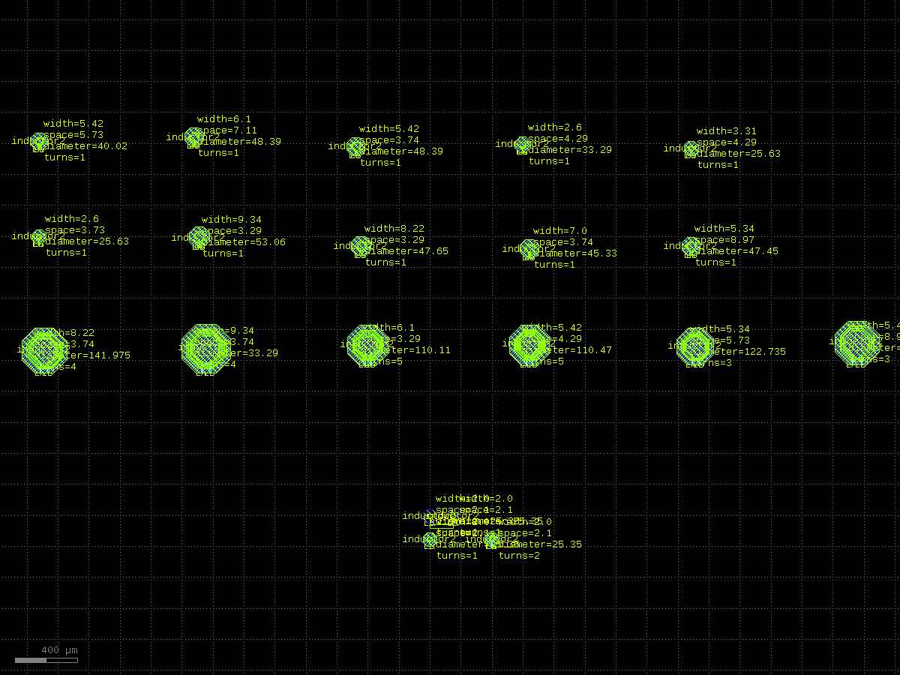 | PDK 1-turn `inductor.gds` |
| 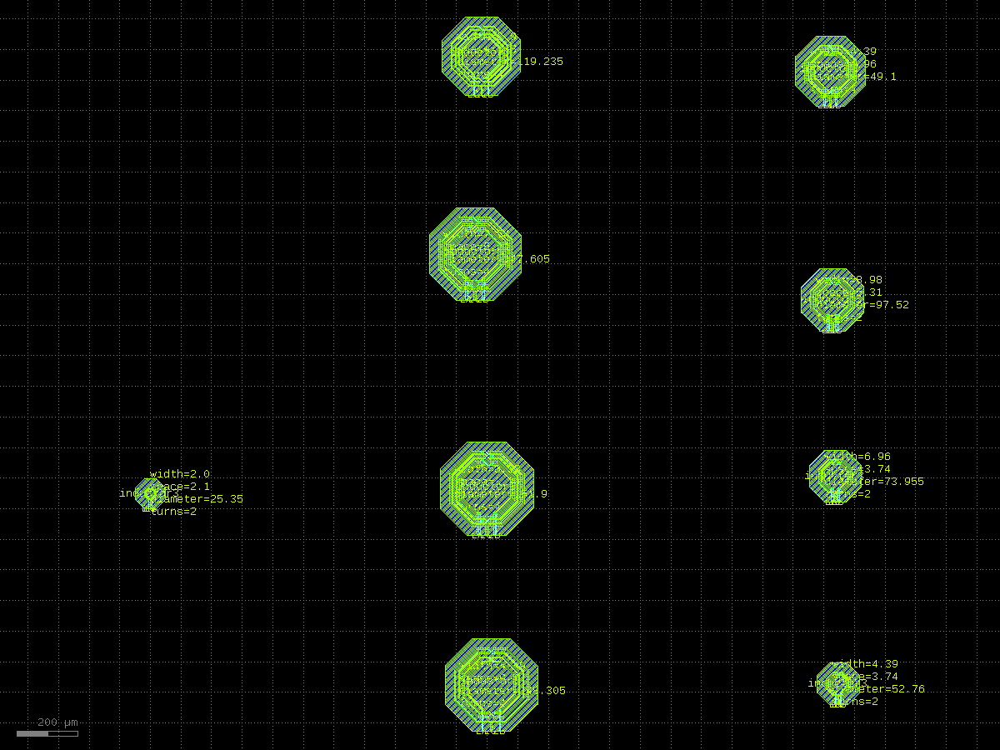 | PDK 2-turn center-tap `inductor3.gds` |
| 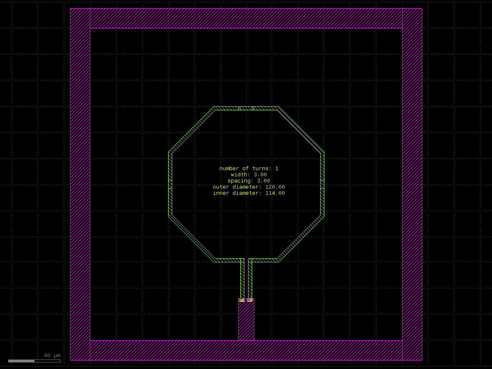 | Synthesized 1-turn octagon (EM `turn1`) |
| 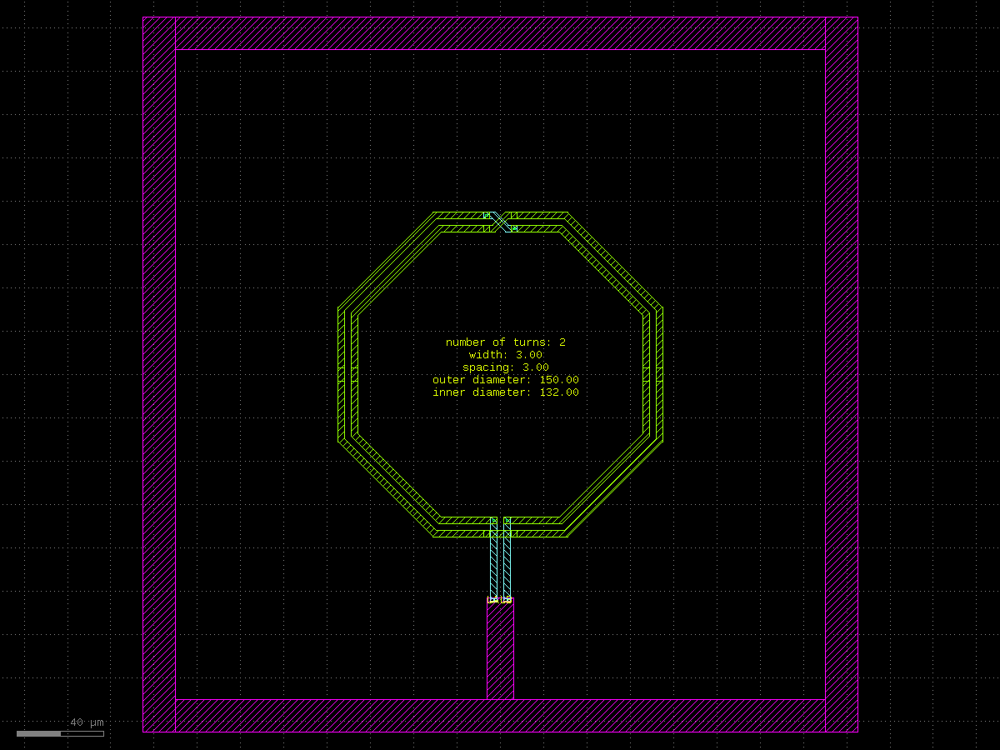 | Synthesized 2-turn octagon (EM `turn2`) |
| 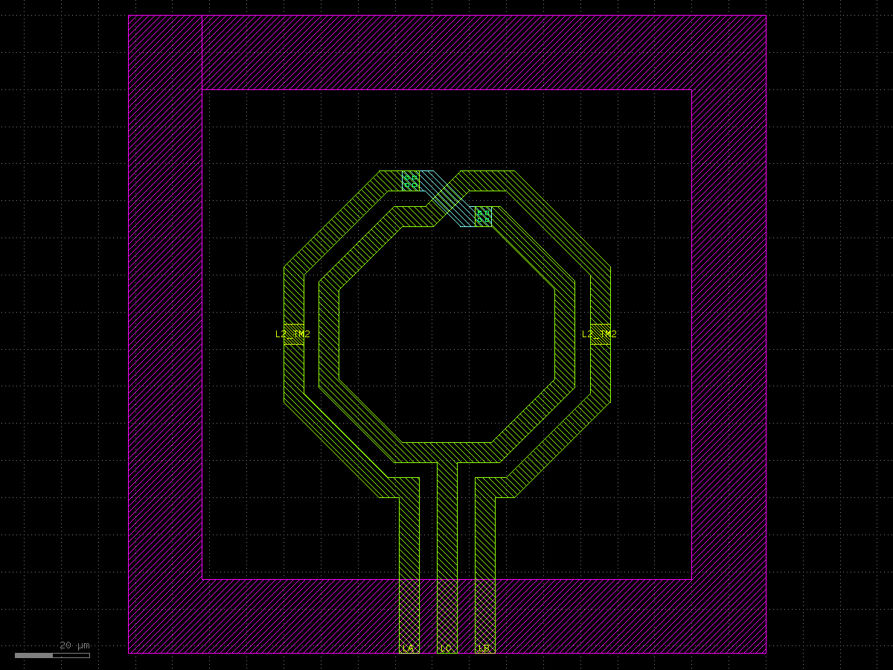 | Palace workflow 500 pH with ports |
