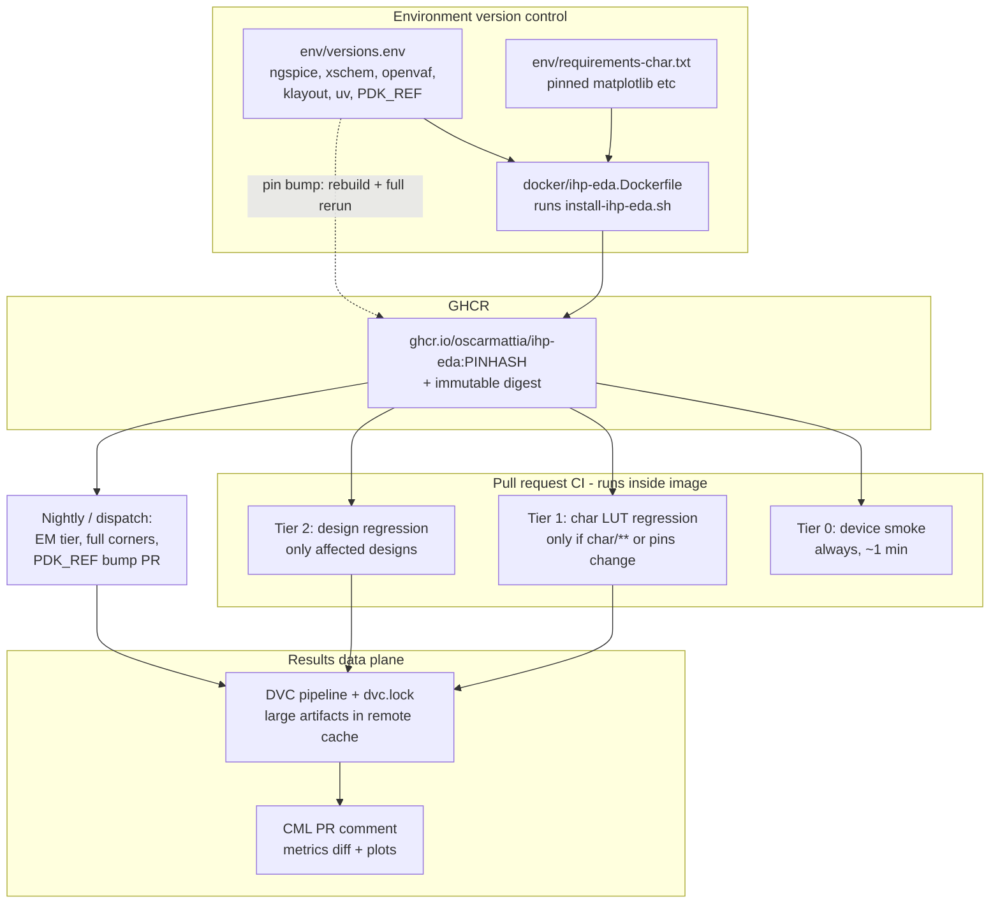
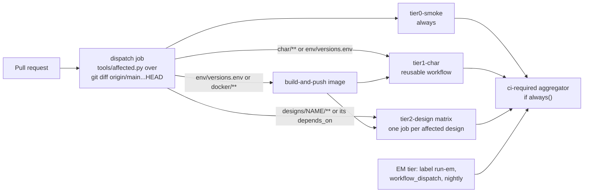
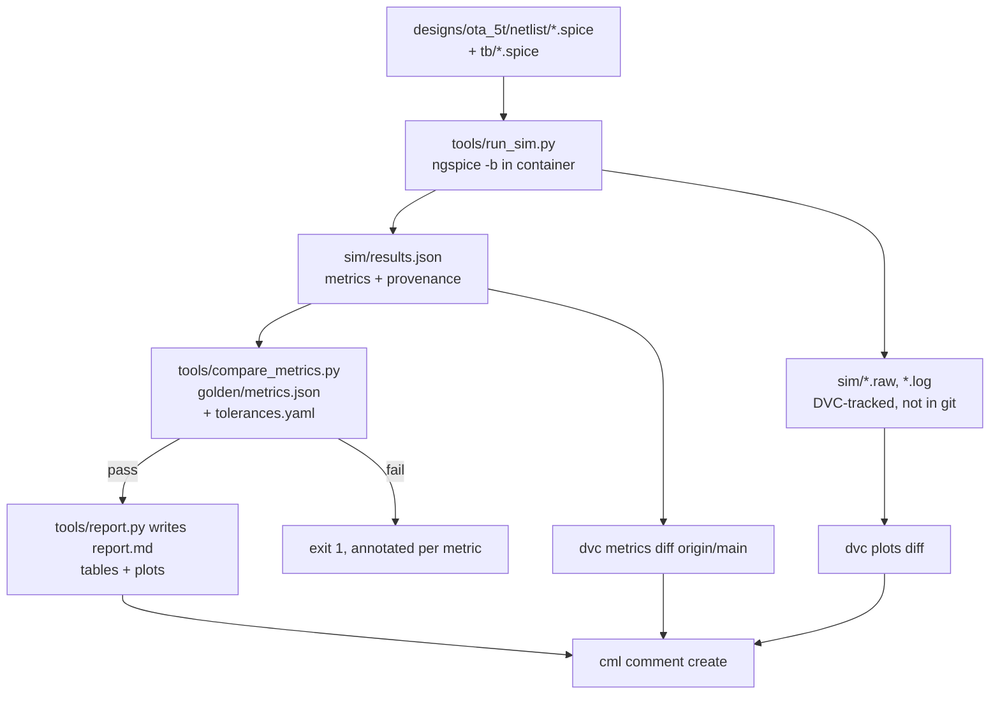
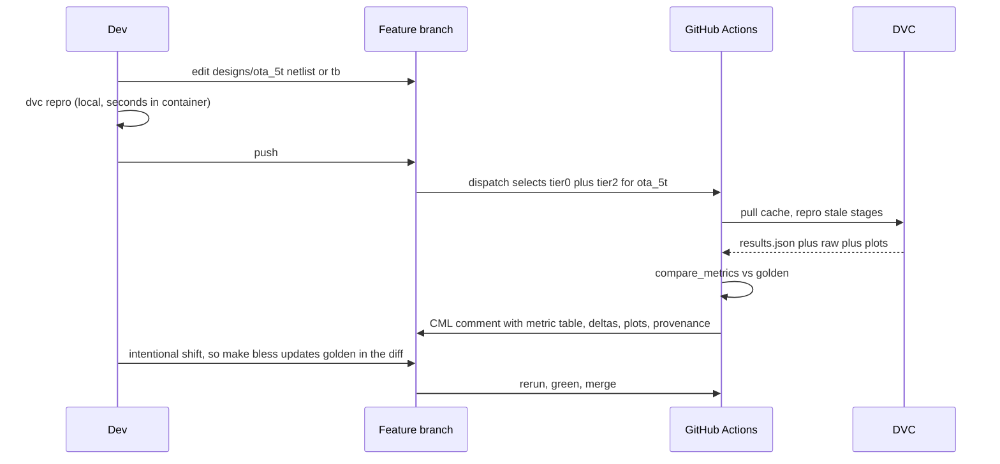

# CI/CD plan — pinned environment image, tiered regressions, DVC + CML reporting

**Status:** Phase 0 (ruff lint on GitHub Actions) **has landed**. The rest of this document
remains a **draft** proposal; treat phases 1–9 as the current backlog, not a commitment.

## Landed

- **Phase 0 — lint gate:** root [`pyproject.toml`](../pyproject.toml) (ruff `E,F,I` with
  `E501`/`E402`/`E741` ignored) plus [`.github/workflows/lint.yml`](../.github/workflows/lint.yml).
  Runs on hosted `ubuntu-latest` **outside** the future GHCR image (no PDK, no ngspice). No
  `ruff format` mandate.

## Why this shape

Measured on a Cloud Agent VM (writing to `/tmp` only, repo untouched):

- [`scripts/verify-ihp-eda.sh`](../scripts/verify-ihp-eda.sh): **0.11 s**
- All 4 MOS families (8 LUTs): **7.9 s**; BJT **0.5 s**; resistors **0.7 s**; capacitors **2.6 s**
- Entire non-EM characterization suite: **~12 s**
- Two consecutive `lv_core` sweeps: **byte-identical** `.npz` (same SHA-256)
- Committed LUTs vs a fresh run: every shared array `max_rel_diff = 0.0`

Conclusion: CI cost is 100% environment provisioning
([`scripts/install-ihp-eda.sh`](../scripts/install-ihp-eda.sh) builds ngspice + xschem from
source, installs LLVM 21, clones a 554 MB PDK, compiles OSDI) and ~0% simulation. So: build
the environment **once** as a versioned image, then regressions cost seconds. Determinism
inside a fixed image means tolerances can be tight.

## Architecture



The environment and the designs are versioned **separately without submodules**: the
environment's identity is `env/versions.env` plus the resulting image digest, which every
report records; designs are packages under `designs/` with their own goldens. Staying a
monorepo keeps environment bumps and design changes atomically reviewable in one PR diff.

Alternatives considered: split repos plus submodules (true independent cadence, but detached
HEAD friction and coordinated two-PR bumps); split repos plus artifact distribution (GHCR
image and char LUTs as a versioned wheel — better than submodules for artifacts, worth
revisiting if the environment is ever published for others);
[IIC-OSIC-TOOLS](https://github.com/iic-jku/IIC-OSIC-TOOLS) as a base image instead of
building from scratch; Nix or Pixi for hash-pinned environments without Docker.

## Trigger routing

One always-running dispatcher computes the affected set, so path filters never leave a
required check permanently "skipped" (the branch-protection trap).



`designs/<name>/design.yaml` declares dependencies so shared blocks fan out correctly:

```yaml
name: ota_5t
depends_on: [char/mos, blocks/bias, pdk]
testbenches: [tb_ac_ol, tb_dc_op, tb_tran_slew]
corners: [mos_tt]        # full corners only on nightly
```

PDK changes are triggered by a **pin bump in this repo**, not an upstream event. Today
`PDK_BRANCH=dev` floats, so upstream can silently move results with no commit to blame. Pin
`PDK_REF` to a SHA and let a scheduled job open the bump PR.

## Testbench results data, DVC and CML

Each testbench run emits one JSON next to its raw output:

```json
{
  "design": "ota_5t", "testbench": "tb_ac_ol",
  "corner": "mos_tt", "temp_C": 27,
  "metrics": {"gain_dB": 41.2, "ugbw_Hz": 3.9e7, "pm_deg": 68.1, "idd_A": 5.2e-5},
  "provenance": {"repo_sha": "...", "image_digest": "sha256:...",
                 "pdk_ref": "970a7688", "ngspice": "45.2"}
}
```



Division of labour: the dispatcher decides which **jobs boot**; `dvc repro` decides which
**stages actually re-run** (via `dvc.lock` hashes), so a docs-only touch inside a design
package costs nothing.

DVC specifics that matter:

- `dvc metrics` accepts JSON/YAML/TOML only. Existing `summary.csv` files register under
  `plots`; add a small derived `metrics.json` per suite for `dvc metrics diff --md`.
- Move `char/*/out` (9.5 MB in `char/mos/out` alone) from git to DVC `outs`:
  `git rm -r --cached`, then declare `outs` in `dvc.yaml`. History keeps the existing ~12 MB
  but stops growing ~10 MB per re-characterization commit, and unreviewable PNG diffs leave
  the diff view.
- Golden files stay **in git as text** (`golden/metrics.json`, `tolerances.yaml`) so a
  regression shows up as a reviewable numeric diff.
- CML needs `permissions: {contents: read, pull-requests: write}` and posts with the built-in
  `GITHUB_TOKEN`.

`char/dvc.yaml` sketch:

```yaml
stages:
  char_mos:
    cmd: ./char/mos/run_all.sh
    deps: [char/mos/ihp_sweep.py, char/mos/summarize.py, char/common/lut.py, env/versions.env]
    outs: [char/mos/out]
    plots: [char/mos/out/summary.csv]
    metrics: [char/mos/out/metrics.json]
```

Tolerances are explicit per metric, because an ngspice or PDK bump legitimately moves values
and should surface as a numeric diff rather than a hash mismatch:

```yaml
defaults: {rel: 0.02}
metrics:
  Vth_V:        {abs: 0.002}
  Ion_A_per_um: {rel: 0.01}
  gain_dB:      {abs: 0.25}
  pm_deg:       {abs: 1.0}
```

## Design iteration loop



`make bless` (or `compare_metrics.py --update-golden`) is the ergonomic that makes this
usable: intentional shifts get approved as numbers in the PR diff.

## Prerequisite fixes

Defects found while measuring; these block a trustworthy gate and land first.

1. `matplotlib` is **not installed** in the venv, yet every `char/*/summarize*.py` imports it
   (all already call `matplotlib.use("Agg")`, so only the dependency is missing). The PDK
   `requirements.txt` has no matplotlib; it arrives only as a side effect of
   [`scripts/install-ihp-em.sh`](../scripts/install-ihp-em.sh). Add a pinned
   `env/requirements-char.txt`, installed by `install_python()` in
   [`scripts/install-ihp-eda.sh`](../scripts/install-ihp-eda.sh) and by the Dockerfile.
2. [`scripts/verify-ihp-eda.sh`](../scripts/verify-ihp-eda.sh) only greps for `id =` and never
   checks the value, though [`scripts/AGENTS.md`](../scripts/AGENTS.md) documents
   `Id` ≈ `1.14e-6`. Assert numerically (measured `1.145621e-06`) with a tolerance.
3. All eight `run_*.sh` hardcode `source "${HOME}/.local/share/ihp-eda/env.sh"`
   ([`char/run_all.sh`](../char/run_all.sh), [`char/mos/run_all.sh`](../char/mos/run_all.sh),
   [`char/bjt/run_all.sh`](../char/bjt/run_all.sh),
   [`char/passive/run_all.sh`](../char/passive/run_all.sh),
   [`char/passive/run_res.sh`](../char/passive/run_res.sh),
   [`char/passive/run_cap.sh`](../char/passive/run_cap.sh),
   [`char/passive/run_ind.sh`](../char/passive/run_ind.sh),
   [`char/passive/run_render_layouts.sh`](../char/passive/run_render_layouts.sh)), which breaks
   in a container with a different `IHP_EDA_ROOT`. Use
   `"${IHP_EDA_ROOT:-$HOME/.local/share/ihp-eda}/env.sh"`.
4. [`char/passive/run_ind.sh`](../char/passive/run_ind.sh) swallows EM failure (`set +e` then a
   warning) and [`char/passive/ihp_ind_em.py`](../char/passive/ihp_ind_em.py) writes placeholder
   `.npz` with `em_completed: false`, so an EM job would silently pass. Add `--require-em`
   asserting the `em_completed` column in `ind_summary.csv`.
5. Committed MOS `.npz` carry `migrated_from: lv_core_n.pkl` plus three scalar keys (`NFING`,
   `TEMP`, `W`) that `ihp_sweep.py` no longer emits, so they are not reproducible by
   `run_all.sh`. Regenerate before freezing goldens.
6. Extract pins from the installer (`NGSPICE_TAG`, `XSCHEM_TAG`, `OPENVAF_R_VERSION`,
   `KLAYOUT_DEB_VERSION`, `UV_VERSION`) into `env/versions.env`, add `PDK_REF`, and have
   `clone_pdk()` check out the SHA.
7. Image slimming: shallow clone plus sparse checkout of `ihp-sg13g2` drops ~520 MB of PDK
   `.git` (`libs.tech` is 156 MB of the 554 MB tree).
8. ~~Root [`AGENTS.md`](../AGENTS.md) repo map lists `pdk/` as a "PDK submodule"~~ — **done**
   on main (`pdk/` is documented as a gitignored symlink to `$PDK_ROOT`).

## Target layout

```
pyproject.toml                         # ruff (landed); future pytest config
.github/workflows/lint.yml             # Phase 0: ruff check only (landed)
.github/AGENTS.md                      # workflow contract (landed)
.github/workflows/{ci.yml,env-image.yml,_design.yml,_char.yml,nightly.yml,pdk-bump.yml}
docker/ihp-eda.Dockerfile
env/{versions.env,requirements-char.txt}
tests/test_devices_smoke.py          # Tier 0, pytest-parametrized
tools/{affected.py,run_sim.py,compare_metrics.py,report.py,metrics_from_csv.py}
char/{dvc.yaml,mos/golden/,bjt/golden/,passive/golden/}
designs/<name>/{netlist/,tb/,sim/,golden/,report/,design.yaml,dvc.yaml}
Makefile                             # make smoke | char | design DESIGN=x | bless
```

## Runner notes

Hosted `ubuntu-latest` (4 vCPU / 16 GB) fits Tiers 0-2 and openEMS `l2n0`; Palace needs
>=32 GB and stays local or self-hosted. The EM tier never runs on plain PRs.

## Implementation phases

0. **Lint gate (landed)** — [`pyproject.toml`](../pyproject.toml) ruff `E,F,I` with
   `E501`/`E402`/`E741` ignored; [`.github/workflows/lint.yml`](../.github/workflows/lint.yml);
   excludes `**/out/**`. Runs on hosted `ubuntu-latest` outside the future GHCR image.
1. **Prerequisite fixes** — the remaining seven items above.
2. **Container image** — `docker/ihp-eda.Dockerfile` with shallow/sparse PDK checkout, plus
   `env-image.yml` publishing to GHCR tagged by a hash of `env/versions.env`, on pin changes
   and weekly; expose the image digest as a job output.
3. **Tier 0 smoke** — `tests/test_devices_smoke.py`, pytest-parametrized active + passive sims
   (NMOS/PMOS op point, NPN Gummel point, `rsil`/`rppd`/`rhigh` DC R, MIM cap AC, OSDI load)
   asserting golden values with tolerances.
4. **DVC pipeline** — `char/dvc.yaml` stages, move `char/*/out` to DVC outs, add
   `tools/metrics_from_csv.py`, cache `.dvc/cache` in CI.
5. **Dispatcher workflows** — `ci.yml` dispatch job plus reusable `_char.yml` / `_design.yml`
   and an `if: always()` aggregator as the single required check.
6. **Design package convention** — `designs/<name>/` layout, `tools/run_sim.py`,
   `tools/compare_metrics.py` with `--update-golden`, and one reference design exercising the
   full loop.
7. **CML reporting** — `tools/report.py` plus PR comments with the provenance footer.
8. **Nightly and PDK bump** — EM tier with `--require-em`, full corners, and an automated
   `PDK_REF` bump PR carrying the metric diff.
9. **AGENTS.md updates** — extend [`.github/AGENTS.md`](../.github/AGENTS.md) for new
   workflows; add guides for `docker/`, `env/`, `designs/`, `tests/`, `tools/`, and `char/`
   notes on DVC-tracked outputs.

## Open decisions

- **DVC remote backend and credentials** (S3/R2/B2 bucket plus GitHub secrets). Until
  provided, phase 4 lands with no remote plus `actions/cache` of `.dvc/cache`, which keeps
  `dvc repro` and `dvc metrics diff` working within a branch but not across fresh clones.
- Whether to keep dual-writing pygmid `.pkl` LUTs once `char/*/out` moves under DVC.
