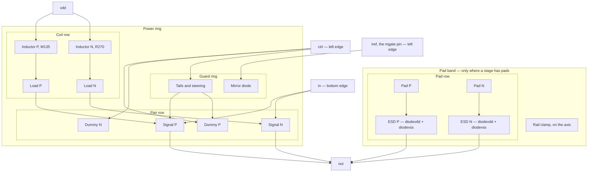

# Physical layout flow — IHP SG13G2

How layout is generated and signed off in this repo. Device facts belong in
[PDK.md](PDK.md); tool versions and paths in [ENVIRONMENT.md](ENVIRONMENT.md);
pitfalls in [../MEMORY.md](../MEMORY.md).

## Shape of the flow

Devices are **foundry PCells** from the PDK's own `sg13g2_pycell_lib`.
gdsfactory is used for **composition and electrical routing only**.

That split is deliberate. The PCells are the authoritative geometry and are what
the LVS deck's device extraction is written against, so placing them directly
removes any chance of our geometry disagreeing with the foundry's. gdsfactory
supplies what PCells lack — typed ports, hierarchy and bundle routing — without
having an opinion about what a transistor looks like.

```
DeviceSpec ──► PCell placement ──► GDS ──► PDK DRC deck   ──► JSON verdict
    │                                └──►  PDK LVS deck   ──► JSON verdict
    │                                └──►  Magic extract  ──► parasitic netlist
    └──► CDL netlist ─────────────────────► (LVS reference)
```

A single `DeviceSpec` feeds the PCell parameters, the CDL element line and the
port names, so layout and netlist cannot drift apart silently.

## Install and verify

```bash
./scripts/install-ihp-layout.sh          # KLayout, Magic, netgen, gdsfactory
source ~/.local/share/ihp-eda/env.sh     # sources layout.env.sh automatically
./scripts/verify-ihp-layout.sh           # --quick skips the deck runs
```

`verify-ihp-layout.sh` is the gate. It checks the version triple, starts Magic
and netgen headless against the PDK tech files, runs the DRC and LVS decks on
the PDK's own testcases, and routes two PCell devices through gdsfactory and
puts the result through DRC.

### Tool versions come from the PDK

`$PDK_ROOT/versions.txt` is the single source of truth, and the PDK enforces it:
`run_drc.py` refuses to run when the KLayout binary is older than the pin, with
`Minimum required KLayout version is 0.30.5`. The installer reads the file
rather than hardcoding versions.

Two version facts worth knowing:

- **KLayout is built from source here.** `klayout.org` and `klayout.de` are
  blocked by this environment's egress policy, so the official `.deb` cannot be
  fetched and the installer falls back to a GitHub source build. Add
  `klayout.org` and `klayout.de` to the Cloud Agent network allowlist to get the
  fast path. The build passes `-nolibgit2`, dropping the GUI package manager
  that would otherwise need `git2.h`.
- **The klayout pip module is pinned below what gdsfactory asks for.**
  gdsfactory 9.44 depends on kfactory >= 2.5, which declares `klayout >= 0.30.8`,
  while the PDK pins 0.30.5. The PDK version wins: it is the combination IHP
  tested, and it keeps PCell generation and the DRC binary on the same KLayout.
  The routing spike in verification exercises kfactory end to end so this is
  validated rather than assumed.

## Signoff decks

| Check | Entry point | Wrapper |
| --- | --- | --- |
| DRC | `tech/drc/run_drc.py` | `layout/common/drc.py` |
| LVS | `tech/lvs/run_lvs.py` | `layout/common/lvs.py` |
| PEX | Magic `extract` / `ext2spice` | `layout/common/pex.py` |
| PEX cross-check | `klayout.pex` (R only) | `layout/common/pex.py` |

Both wrappers reduce the tools' output to JSON — a verdict, counts per rule and
a few examples — so an agent never has to scrape a log.

### Do not restrict DRC tables by hand

Passing `-rd tables=...` straight to the deck breaks it:

```
ERROR: In .../ihp-sg13g2.drc: '-': Argument needs to be a DRC layer
```

The connectivity section runs unconditionally and references layers that only
the full table set defines. The PDK's own CI pairs `--table=` with
`--no_feol --no_beol ...` for this reason. Go through `run_drc.py`, which manages
the combinations.

This error is worth naming precisely because it looks like a version problem and
is not: it appears on any KLayout version when the table list is restricted. The
upgrade is still required, but for a different reason — `run_drc.py` refuses to
run below the `versions.txt` pin.

### Judge LVS on the report, not the exit code

`run_lvs.py` exits 0 even when the compare fails. Reading the return code
reported four mismatched blocks and one mismatched device as clean. `lvs.py`
looks for `Netlists match` in the output instead.

### Magic needs a newer version than versions.txt pins

`ihp-sg13g2.tech` carries `requires magic-8.3.617` while `versions.txt` says
8.3.589. Below the tech file's floor its `version` and `cifinput` sections fail to
load and Magic cannot read a GDS at all. The installer takes the higher of the
two.

### Numeric limits come from the PDK

`layout/common/rules.py` reads `rule_decks/sg13g2_tech_default.json`, the same
table the deck loads. Nothing in the layout code should carry a transcribed
limit: a hand-written width table had TopMetal1 at 1.50 um against the 1.64 um
minimum, and the deck only caught it once a route used that metal.

### Electromigration, and the one gap in it

`layout/common/em.py` reads `DCCURRENTDENSITY AVERAGE` from
`libs.ref/sg13g2_stdcell/lef/sg13g2_tech.lef`. That is the **only**
machine-readable source of current limits in this PDK — not the DRC decks, not the
ITF, not the Magic tech files — which has two consequences.

There is **no signoff check** for electromigration here. The limits are LEF
metadata for tools that consume it, so anything drawn in this repo has to be
checked by us. `em.check_segments` does that and the CTLE stage reports it as a
gate alongside DRC and LVS, writing `em.json` next to the layout.

And `Cont` has a resistance but no current limit, so MOS source/drain contact
electromigration cannot be checked from open PDK data. `em.UNCHECKABLE` records
that, and `max_current_a` raises for such a layer rather than returning a number,
so silence cannot pass for a verified limit. The nearest analogue is the resistor
PCells' `ikspec` of 0.11–0.30 mA per contact, which is not stated for MOS
contacts; if it applied it would bind on a wide tail.

| Layer | Limit | 8.67 mA supply needs | Drawn |
| --- | --- | --- | --- |
| Metal2 | 2 mA/um | 4.32 um | 8.64 um (2x derate) |
| Metal5 | 2 mA/um | 1.44 um per tail | 2.88 um |
| TopMetal1 | 15 mA/um | 0.58 um | 6.0 um (min width and corner vias) |
| TopMetal2 | 16 mA/um | 0.54 um | 6.0 um |
| Via1 | 0.4 mA/cut | 8 cuts per tail | 24 per unit terminal |
| TopVia2 | 10 mA/cut | 1 cut | 4 per ring corner |

Sizing uses a 2x derate (`em.DEFAULT_DERATE`) because the current is an
operating-point estimate rather than a worst-case corner; the check itself only
insists on 1x. On the thin metals EM decides the width — the array's previous
hand-picked 1.0 um rail was 45% under what 2.9 mA needs — while on the top metals
the PDK minimum width wins by an order of magnitude, so the ring is
minimum-width limited and runs at 9% of its EM limit.

An EM width is a computed number, so snap it: an unsnapped rail reports
`metal2_drw_Offgrid`.

### Netlist parity

LVS compares layout against the CDL and never compares the CDL against the
schematic, so a device missing from both is invisible. That is how the bias diode
stayed absent from the CTLE layout for several revisions.

`layout/common/parity.py` closes the loop: it resolves the schematic's `{TOKEN}`
parameters from `params.inc`, reduces both netlists to devices keyed by model and
geometry, and reports what only one side has. The CTLE stage runs it **before**
DRC, since there is no point asking whether the layout matches a netlist that does
not match the schematic.

One substitution is permitted, in `MODEL_ALIASES`: `ind_shunt`, an EM-fitted
lumped subcircuit, stands in for the `inductor` PCell, because the PDK has no
ngspice inductor model. Geometry is still compared — `size_ind.py` writes the case
it solved into `ind_shunt.inc`'s header, so `w`, `s` and `d` are read from there.

Parity also constrains the **schematic**. The deck compares MOS `W` and `L` with
essentially no tolerance (`rule_decks/custom_devices.lvs` relaxes only inductors,
5% on `w`/`s`/`d`, and diodes, 1% on `A`/`P`), and a wide MOS is drawn as an array
of single-finger units whose per-finger width lands on the **0.01 µm PCell grid**
(`mos_array.MOS_W_GRID`), not the 5 nm layout database grid — conflating the two
silently mis-sized tails. `size_ctle.py` emits the drawable width, and parity fails
if the two rules ever drift apart.

What the deck accepts for a 25-unit 243 um array, measured: one `w=243u ng=1 m=1`,
one `w=9.72u m=25`, and 25 explicit 9.72 um devices all match, so no
layout-specific restructuring is needed and both netlists carry one device.

Because the cell that is laid out can only contain devices, bias current sources
and pad capacitance live in the testbench; `mgate`, `vicm`, `steerp`/`steern` and
`vss` are pins rather than the global node `0`, so the port list matches the layout.
All four stage netlists (`term_pdk.cir`, `ctle_pdk.cir`, `vga_pdk.cir`,
`driver_pdk.cir`) follow that contract.

### Context rules

Some rules constrain a cell's *surroundings* and cannot be satisfied by an
isolated device:

| Rule | Why an isolated cell fails it |
| --- | --- |
| `LU.b` / `LU.a` | latch-up wants a substrate tie within 20 um; a lone device has none |
| `LBE.a` | local-back-end minimum width is 100 um, a chip-area marker |
| density | a bare device cannot meet metal density |
| antenna | needs the full connected net |

`layout/common/drc.py` lists these in `CONTEXT_RULES` and reports them
separately rather than dropping them, so `clean` means "no real violations" and
`strictly_clean` is the unfiltered verdict. The classification is evidence
based: running the same deck on the PDK's own device layouts under
`tech/lvs/testing/testcases/unit` trips `LU.b` 35 times on `sg13_lv_nmos`.
Pass `allow_context=False` at block level, where guard rings exist.

## Devices

`layout/common/devices.py` is the registry. Each entry ties a logical device to
its PCell, its CDL element form (taken from the PDK LVS testcases), its terminal
names, and what LVS extraction actually reports back.

Parameters are given in SI base units and translated there, so callers never
hand-format PCell unit strings.

### PCell traps encoded in the registry

- **`library_by_name` needs the technology name.**
  `pya.Library.library_by_name("SG13_dev")` returns `None`; the second argument
  is required.
- **Resistors and capacitors ignore `w`/`l` unless `Calculate` is changed.**
  `rppd` defaults to solving for `l` from a target `R`, `cmim` to solving for
  `w&l` from a target `C`. Passing a geometry without setting `Calculate`
  silently yields the default device.
- **`nmos` clamps `ng` at 100 and floors finger width to 0.01 µm.** Asking for 122
  fingers of a 242.988 um device quietly draws 100 fingers of 2.43 um, i.e.
  243 um. `catalog.plan_fingers()` caps the count and puts the total on
  `MOS_W_GRID` (0.01 µm). Drawn routes still snap to the 5 nm database grid.
- **The LVS deck reports MOS width per finger**, and reports taps as area and
  perimeter rather than `w`/`l`. **`Nx` on `npn13G2` is geometry, not `m`.**
  `DeviceKind.to_extracted` states what to expect per device; capacitors are
  checked on area, which is what sets `C`.

## Ports

Ports are derived from what the PCells already draw, not hardcoded:

1. pin shapes on the `*_pin` layers mark the terminals,
2. annotation text on `text_drw` (63/0) names them where the PCell writes one —
   `npn13G2` labels its pins `C`, `B` and `E`,
3. otherwise a per-kind rule in `wrap.TERMINAL_RULES` names them by geometric
   order.

Step 3 is safe for the devices that need it because MOS source/drain and the two
terminals of a resistor or capacitor are permutable in the LVS device classes.

Ports advertise the **drawing** layer of their metal, not the pin layer, because
gdsfactory matches a route's cross-section layer against the port layer.

### Net labels

Net names go on the `*_text` layer of the metal a pin sits on (Metal1 is 8/25,
Metal2 10/25). They are not strictly required — the PDK's own testcase layouts
carry none, and the deck matches on connectivity with
`--ignore_top_ports_mismatch` — but they make the compare able to check the port
mapping, and they matter once several devices share a cell.

There is no `gatpoly_text` layer, so a MOS gate net can only be named where the
gate reaches metal. `gen_devices.py` records such terminals under
`unlabelled_terminals` in the manifest.

## Routing

```python
from layout.common.route import device_component, route_electrical
c = device_component(spec)
route_electrical(top, [a.ports["MINUS"]], [b.ports["PLUS"]], metal="Metal1")
```

**Every bundle stays on one metal.** A metal change needs a via stack built to
SG13G2 rules, which gdsfactory knows nothing about, so `route_electrical`
refuses a bundle whose ports are on another layer and points at the `via_stack`
PCell instead of letting gdsfactory invent a taper. `auto_taper` is off for the
same reason.

`layout/common/xsection.py` registers a minimal gdsfactory PDK: cross-section
factories per metal (`metal_routing` aliases TopMetal2, the thick RF metal), the
`wire_corner`/`straight`/`taper` primitives that electrical routing resolves by
name, and a `LayerMap` of the routing stack.

Two gdsfactory details that cost time:

- **`activate_pdk()` must run before any other gdsfactory call.** gdsfactory
  resolves its default PDK from `$PDK`, which `env.sh` sets to `ihp-sg13g2` for
  the SPICE flow. That is not an importable Python module, so `get_active_pdk()`
  raises until a PDK is activated explicitly.
- **Cross-sections must be registered as factories**, not instances, or
  kfactory raises `'CrossSection' object is not callable`.

The routing `LayerMap` is the one hand-written layer table in the flow, because
gdsfactory needs its members at class-definition time. Everything else parses
`rule_decks/layers_def.drc`. `layers.validate_routing_layers()` compares the two
and verification fails on drift.

## Stage floorplan template

All four RX stages use one floorplan. It is symmetric about a single vertical axis,
stacked bottom to top, and every stage script places its devices into these rows.



Pins leave on fixed edges so the stages cascade by abutment: **`out` and `vdd` at
the top**, **`in` at the bottom**, **`ctrl` and `Iref` on the left**, `vss` at the
bottom inside the ring. `Iref` is the `mgate` pin; `ctrl` is whatever bundle of
references a stage needs — for the VGA that is `vicm`, `steerp` and `steern`, all
three leaving the left edge on Metal3 at three separate y. `vicm` cannot go on
Metal4 with `inp`/`inn`: the dummy bases sit either side of the axis, so its bus
has to cross the middle, and the input trunks run down through there.

What each stage puts in each row:

| Row | CTLE | VGA | Pad driver | Termination |
| --- | --- | --- | --- | --- |
| Pad band | — | — | clamp, two pads, four ESD, at the **top** | clamp, two pads, four ESD, at the **bottom** |
| Coil row | two coils, `rppd` loads | two coils, `rppd` loads | two coils, `rsil` loads | — |
| Pair row | `npn13G2` pair | signal pair inboard, dummy pair outboard | `npn13G2` pair, `Nx=2`, no dummies | — |
| Control channel | `rsil ‖ cmomi` degeneration | `em`, `ed1`/`ed2` and `vicm` lanes | routing only, no devices | 50 Ω terminators, `vtt` divider |
| Steering row | — | `pd1 \| ps1 ┊ ps2 \| pd2`, own guard ring | — | — |
| MOS row | mirror diode, two tails | mirror diode, two tails | mirror diode, one double-width tail | — |

A stage draws only the rows it needs, and the rows it does not need collapse rather
than being left as gaps. The pad driver has no dummy devices flanking its pair and
no control nets at all, so its pair row is just the two transistors and its control
channel carries only the `in` column and the tail current path.

### The pad band

A stage with bond pads gets a band of its own **and a power grid of its own**, so
the pads never sit inside the ring around the active devices and the clamp and the
ESD diodes tie to a rail conductor a few um away rather than reaching down into
the core. Within the band:

- **Pad pitch is 180 um.** The pads are 70 um square, so their centres sit at
  ±90 um from the axis and the channel between them is **110 um** wide. That is
  what lets the ESD columns sit between the pads at the pads' own height rather
  than in a row of their own below them.
- The **clamp sits on the axis at the outer edge**, above both pads, tying `vdd`
  to `vss`, and its two Metal3 taps reach the band ring's top runs in 20 and 55 um.
  Against the core ring that tie was a 240 um horizontal.
- The **four ESD diodes sit in the channel between the pads**, as one column per
  side just inboard of its own pad. The `esd` PCell is 13.06 um wide and 37.05 um
  tall, so two columns take 26 um of the 110 um channel.
- **Stack the column `diodevss` below `diodevdd`.** Each cell brings one rail out
  on Metal1 at an edge and the other on Metal2 at a side, and in that order both
  Metal1 pins — `diodevss`'s VDD on its top edge, `diodevdd`'s VSS on its bottom —
  come out into the gap between the two cells, where they join the Metal2 pins on
  the column's inboard edge. One vdd tap and one vss tap then run down to the band
  ring. Put them at the same x on **Metal2 and Metal3**, which have no spacing
  rule against each other, and each net stays on its own layer end to end so
  neither has to dodge the other.
- **`out` leaves each pad on Metal5** and runs inboard over its ESD column. The
  `bondpad` PCell is a filled Metal3-to-TopMetal2 via stack, so a feed leaves on
  whichever of those layers suits it with no stack of its own.

`Pad.fR` is an **exit length, not a keepout**: it wants any metal that leaves the
pad to run at least 7 um past the pad edge before it stops or turns, and a pad with
no feed at all reports nothing. So a feed does not have to approach from a
distance — it just must not stop short. The `bondpad` cell anchors on its
**centre**, so placing it by bottom-left coordinates puts it 35 um from where it
was meant to go.

The two rings are stitched over the gap between them on **TopMetal1**, vdd on the
axis and vss either side of it, so a strap passes under the other net's TopMetal2
horizontal instead of routing around it. Two details are not optional:

- **Take the strap from the ring's `top` port, not its `bottom` one.**
  `PowerRing.ports[net]` is ordered `[top, bottom, left, right]`; index 1 sent a
  TopMetal1 bar the length of the core, straight over the coils.
- **Run the strap the full width of both conductors it lands on**, not centre to
  centre. A via field is placed about its centre, so its outer row of TopMetal1
  pads otherwise sits outside the strap as islands 1.1 um away, which is `TM1.b`.

For the termination the band is at the **bottom** rather than the top, because its
pads are the chip inputs; the 50 Ω terminators and the `vtt` divider then occupy the
control channel. For the pad driver the band is at the top, because its pads are the
outputs.

Two properties of the template are what make it routable, and both are departures
from the CTLE as originally drawn:

**The signal is one straight column on the axis.** `in` runs from the bottom edge
up to the bases and `out` from the collectors up to the top edge, both inside the
channel between the two coil bodies. Offsetting the output trunks either side of
the axis costs turns and puts horizontal runs at heights where other nets rise.

**The loads sit directly above the pair and directly below the coil strap**, so
the load column is `coil -> load -> collector` with no horizontal run. The CTLE
places its loads near the axis and brings `nlp` inward from each coil feed
instead, which is where 135 um of its output interconnect went.

**A pad feed cannot continue that column past the load.** The load's `nlp` pin
sits directly above its `out` pin, and the via stack taking `nlp` up to TopMetal2
passes through Metal5 on the way, so a Metal5 riser at the column's own x shorts
the load out — LVS reports `nlp1|outp` with the resistor's two terminals on one
net. Bring the riser down a few um inboard of the column, inside the coil channel,
and jog across at the collector row.

### Order devices so every net rises in a straight column

**Split rows so that each net is a vertical between adjacent rails.** A
`mos_array` puts its drain rail on top and its source rail on the bottom, so which
row a device goes in decides how far its nets have to travel. The VGA reads
`Xtail1 tx1 mgate vss vss` and `Xps1 em steerp tx1 vss` — a tail's drain and a
steering device's source are the same net — so with the steering devices in a row
of their own **above** the tails, `tx1` is tail1's top rail meeting ps1's and
pd1's bottom rails, and `em`/`ed1`/`ed2` are the steering row's top rails facing
the HBT emitters. Nothing needs a horizontal at another array's x.

The rows are `mdiode | tail1 ┊ tail2` and `pd1 | ps1 ┊ ps2 | pd2`, with the axis
at `┊`: `ps1`/`ps2` inboard so `em` is the innermost pair under the signal HBTs,
`pd1`/`pd2` outboard so `ed1`/`ed2` sit under the dummies, and the pair row
`Qd1 | Q1 ┊ Q2 | Qd2` above them. The earlier single row
`mdiode | pd1 | ps1 | tail1 | tail2 | ps2 | pd2` needed a horizontal at the
steering source rails' own y to join each tail to its steering pair — and every
array in that row has a rail at that y, so it bridged them and merged `tx1` with
`tx2`.

That is the recurring failure in these blocks: **a run sharing a y (or a layer)
with another net's run**. Collected instances, all paid for:

- A stub leaving one tail's drain that passed through the next array's x merged
  two 246.75 um devices into one 493.5 um device.
- A Metal5 horizontal at the drain row crossed the Metal4 input trunks and merged
  the inputs into the tail drains.
- A supply drop sized `vss_rail_w` (8.6 um) and placed as if it were a thin wire
  landed 0.3 um inside an array box, touching that array's source *and* drain
  rails on the way past.
- Two nets that must cross in x cannot share a y. `em` and `ed1`/`ed2` both climb
  from the steering row to the same emitter row, and each steering drain sits
  outboard of the emitter it feeds, so they take two lanes — `em` the lower one,
  so `em`'s riser crosses `ed`'s lane at a y where `ed`'s horizontal has already
  stopped, and `ed`'s riser sits entirely above `em`'s lane.
- **A via stack shorts on the layers it passes through, not just its endpoints.**
  A Metal2-to-Metal5 stack has Metal3 and Metal4 pads. One of those landed in the
  `vicm` bus and merged `vicm` into `outp` and `outn`; another sat 0.04 um from it
  and reported `M3.b`. Count a lane's via pads when you budget a band's height.

`draw.trunk_net` drops exactly such a stub at each terminal's own y, so it is safe
only where nothing else occupies that y — true in the CTLE, with its single MOS
row and outboard trunks, and false in the VGA and the driver.

**Route a bus on the side its device's pin faces.** An HBT's base is its *bottom*
terminal, so `vicm` belongs below the pair row; bussing it above dragged every
riser up past that device's own emitter and collector. The mirror gate is the same
argument horizontally: tapping it on `mdiode`'s right, when the port leaves on the
left, put the whole route inside the row and it came back merged with the
substrate and `tx1`.

The gate nets are the other place this bites. In the CTLE every gate is `mgate`, so
one poly strap across all three arrays works. In the VGA the MOS row is all
`mgate` and the steering row reads `steern, steerp ┊ steerp, steern`, so the two
control nets interleave and need separate metals. Run them at gate height, where
`mos_array` puts the source rail below and the drain rail above, so a bus there is
crossed by nothing provided every riser starts at the drain rail.

## Power grid and metal budget

The CTLE stage assigns metals so that no two structures contend for one layer:

| Use | Metal | Why |
| --- | --- | --- |
| Device source/drain buses | Metal2 | reachable from the PCell's Metal1 in one via |
| Degeneration legs | Metal4, Metal5 | the capacitor brings p and n out on these two |
| Differential nets (e1, e2, outp, outn) | Metal5 | top minus two, clear of both ring layers |
| Signals out to the cell edges | Metal4 | passes under both ring layers, so the grid stays whole |
| vdd strap, nlp, vss riser, ring horizontals | TopMetal2 | thick RF metal |
| Ring verticals, vdd riser | TopMetal1 | crossing the other net's horizontals without a short |

`layout/blocks/power_ring.py` draws the ring: two nets side by side, horizontal on
TopMetal2, vertical on TopMetal1, stitched at the corners with TopVia2. Splitting
the directions across two layers is what makes it a grid rather than four bars —
a horizontal run and a vertical run of the same net can cross the other net's run.

Two constraints that decide the ring's geometry:

- **Top vias are single large-area cuts.** `via_stack` draws one TopVia2 cut per
  instance; its row and column parameters only multiply thin-metal vias lower in a
  stack. So cut count is instance count, and the instances have to fit inside the
  square where the two runs overlap — which is what sets the conductor width.
- **Vias must stay inside that overlap square.** Spread along or across the run
  they push a landing pad past the conductor edge and into the spacing to the
  neighbouring net.

Both supplies tap the ring **on the symmetry axis**: vss down from the source rail
to the inner run, vdd up from the coil strap to the outer one, crossing under the
inner run on TopMetal1. Do not skip the physical connection — a ring that only
shares a *label* with the supply passes LVS, because the compare is device-level
and no device touches the ring. Check it geometrically instead, merging the real
polygons rather than their bounding boxes: a coil's octagon bounding box swallows
everything inside it and makes unrelated nets look connected.

The substrate is tied to `vss` by landing **one** via inside a guard-ring tap's own
Metal1. The taps sit at a pitch, so the ring is not one continuous piece of Metal1
and is a single net only through the substrate; `add_guard_ring` returns
`tap_centres_um` for this. A strap drawn along the ring edge instead leaves a
0.1 um sliver against the tap pads and reports Metal1 and contact spacing all along
the row.

### The coil dictates the floorplan

The coils face each other, `M135` on the left and `R270` on the right, which puts
each one's pins on the edge nearest the axis with PLUS above MINUS. vdd is then a
short strap between two adjacent pins and each `nlp` leaves directly below its own
vdd, with both 108 um bodies extending outward and a channel down the middle for
everything that has to cross the coil row.

Two things constrain that, and neither is a tuning knob.

**Nothing with a substrate tie can sit inside a coil's footprint.** The
`pwell_block` marker covers the whole 108 um cell and `PWB.f` wants 0.24 um between
it and any p-tap. Facing the coils inward means each body reaches as far down as it
reaches up, so the pin row sits a full half-height above the HBTs, whose substrate
ties are the highest p-taps in the cell.

`PWB.f` is 0.24 um, though, so satisfying it exactly leaves the coil body sitting
on those ties. The pad driver adds `COIL_ACTIVE_GAP`, 10 um the deck does not ask
for, on top of the `PWB.f` distance. The cost is `nlp`: the coil pin row rises with
the coil, so 10 um of clearance is 10 um more drawn interconnect per side —
76.9 um became 96.9 um.

**A coil pin must be left colinear with its feed.** The deck derives `w`, `s` and
`d` from the winding geometry inside `ind_drw`, so a connection meeting the feed
inside that marker is measured as part of the winding. Turning `nlp` down at the pin
had both coils extracting as `w=1.5 um, d=45 um` against a drawn 4 um and 40 um —
far outside the deck's 5% inductor tolerance. The strap and both `nlp` runs leave at
the feed's own width and y, and turn only once clear of the marker. Rotation itself
is harmless: measured in isolation, a single `M135` coil extracts at 4 um, and so
does a facing pair joined by a colinear strap.

The loads stay near the axis rather than under the feeds, so the horizontal run
lands on `nlp` — the node between coil and load — where the coil's port capacitance
already sits and which stays out of `C_L`. The drawn length is reported in the stage
summary against the `CL_INTERCONNECT` budget in `params.inc`.

## Post-layout simulation

The extracted layout is simulated through the *same* testbenches as the schematic,
because each stage is a device-only cell (`ctle_dut`, `vga_dut`, `driver_dut`):
a post-layout netlist is just another `dut_cir` for `prepare_tb`.
`layout/blocks/run_postlayout.py --stage {ctle,vga,driver}` writes the wrappers;
the circuit runners take them by path so `circuits/` never imports from `layout/`.

Two device kinds cannot come from extraction and are black-boxed per kind in
`simview.BLACK_BOX_KINDS`:

- `inductor` — the PDK has no ngspice inductor model, and Magic sees the spiral as
  one continuous piece of TopMetal2, so it treats the two ports as a DC short and
  collapses `nlp1`/`nlp2` into `vdd`. The shunt-peaking network disappears
  entirely. The authority is the EM-fitted `ind_shunt`.
- `cmomi` — has a calibrated compact model, which the extractor's finger geometry
  is not.

Removing them means the nets they touched must become pins of the extracted
subcircuit, so `simview.promoted_nets()` derives `nlp1`/`nlp2` (and the CTLE's
`e1`/`e2`) from the instances and a wrapper reconnects the compact models on those
internal nodes while presenting the schematic's own pins.

The simulation view is a build option, `build_*_stage(black_box=...)`, not a
hand-maintained second view — which is the point of a generated layout, since the
two cannot drift. It is gated on LVS against a *reduced* CDL derived from the same
instance list, so every remaining device and all its connectivity is still verified.

### Two flows

| | source of devices | source of parasitics |
| --- | --- | --- |
| KLayout | LVS extraction | none yet; resistance is open work |
| Magic | LVS extraction | Magic's capacitance network |

Magic supplies capacitance only. `extresist` no longer crashes once the coil is
black-boxed, and it writes its `.res.ext` files, but `ext2spice extresist on` emits
no `R` lines into the netlist either flat or hierarchical — the extraction runs and
the netlist writing drops it. Enabling the pass also moves the capacitance by 11%,
because `extract do resistance` re-partitions nodes, so a capacitance-only flow
should leave it off rather than extract both and ignore one. Resistance is therefore
`klayout.pex` work, deferred; see [../layout/debug_pex/FINDINGS.md](../layout/debug_pex/FINDINGS.md).

Both take **devices from the LVS extraction**, and that is not a preference. Magic
cannot describe a strapped array: the 25 units share drain and source nets, so it
puts the merged node's whole diffusion on one arbitrary instance and gives the other
24 `as=0`, which the model file explicitly treats as "calculate it" rather than
"none here". The LVS deck merges the array into the single device it is, with
`W=243u AS=82.62p PS=503u`.

Restricting Magic's capacitors to nets both views share keeps 493 fF and discards
3 fF (0.6%), all of it on resistor body nodes whose parasitics the compact model
already accounts for.

On `vga_dut` the same filter drops far more — **388 fF of 936 fF** — because
`tx1`/`tx2` are drawn and never labelled. Magic names those Metal2 rails
`m2_*#` and the rewrite cannot keep them. That is internal-node C on the
dummy-steer collectors, not output `C_L`; do not add labels just to recover it.

On `driver_dut` Magic keeps **819 fF** cell-total (almost all of it `mgate` /
`em` / pad-to-`vss`) and drops 0.76 fF. The load that sets BW is **144 fF
`outp`–`vss`**, not the deck total. That 144 fF is **not the pad alone**:
the same `bondpad_70um` PCell extracts at **80 fF** in isolation; tying the
ESD column adds **21 fF** of `pad`–`vss`; a TM2 `vss` ring at 6 um adds
4 fF; ~42 fF is still the rest of the pad band. The schematic's 27.68 fF
hand pad is TM1 area-to-sub only (even a lone TM1 plate extracts at 38 fF).
The pad-driver schematic now uses Magic in-situ metal (143.56 fF `PAD_C`) and
Butterworth shunt peaking with EM case `turn1` / `ind_shunt_drv`; the layout GDS
coil is still `turn1_d40` until a later rebuild. See
[../layout/debug_pex/FINDINGS.md](../layout/debug_pex/FINDINGS.md).

Two things a post-layout netlist must do before ngspice will accept it, both handled
by `postlayout.normalise_element()`:

- **Filter parameters against each model.** Extraction emits `A` and `P` on
  `cap_cmomi`, which declares neither.
- **Set `pre_layout=0` on every MOS.** The default of 1 bakes in a layout
  allowance — `dlq = '-1.3721e-08 -((1-pre_layout)*2e-08)'` — so a netlist that also
  supplies extracted `AS`/`AD`/`PS`/`PD` double-counts 20 nm of channel length and
  9 nm of overlap.

### Getting signals out of a ringed cell

The stage cascades, so `outp`/`outn` leave at the top edge and `inp`/`inn` at the
bottom, both on Metal4: it passes under the ring's TopMetal2 horizontals and its
TopMetal1 verticals, so the grid never has to be broken to let a signal out. The
outputs arrive on the Metal5 collector trunk and change to Metal4 above the loads.

The base taps are what make this possible. The HBT stacks collector, emitter and
base at one x with only 0.23 um between the base's Metal1 bar and the emitter's
Metal2 block, so via stacks dropped below each land 1.13 um apart and short — LVS
reports the base merged into the emitter. The base leaves sideways along its own bar
and the emitter keeps the downward offset.

### Wide devices

`layout/blocks/mos_array.py` builds a wide MOS as an array of single-finger units,
because the `nmos` PCell provides no strapping (`ng > 1` extracts as series
devices), ignores `m` in layout, and silently caps one finger near 10 um.

Each unit's source and drain carries a **full-length single-column via stack**
rather than a few cuts at one end: it distributes the contact along the stripe, and
at 0.21 um the column sits on the 0.16 um Metal1 stripe without reaching the gate
poly. Row count is derived by measuring the PCell's own via pitch, so it tracks a
resize.

Two things to get right when strapping:

- **The gate needs a real contact.** The PCell leaves it as bare poly, so a gate
  net cannot leave the device at all. Cont is exactly 0.16 um (`Cnt.a` is a maximum
  too), with 0.07 um of poly (`Cnt.d`) and 0.05 um of Metal1 (`M1.c1`) around it.
  Metal drawn near the strap without a Cont looks connected and is not.
- **A shared supply rail grows away from the devices.** It is much wider than one
  array's own rail, and centred on that rail the extra width reaches into the drain
  via columns, shorting the drains to the source rail.

## Running it

```bash
source ~/.local/share/ihp-eda/env.sh

python layout/devices/gen_devices.py     # GDS, CDL, ports, manifest, PNGs
python layout/devices/run_drc.py         # DRC every device
python layout/devices/run_lvs.py         # LVS every device
./layout/run_all.sh                      # everything, against committed goldens
```

Outputs land under `layout/devices/out/`: `gds/`, `cdl/`, `png/`,
`manifest.json`, `specs.json`, and per-device `drc/` and `lvs/` JSON plus
`drc_summary.json` / `lvs_summary.json`. Tool scratch directories
(`drc_run/`, `lvs_run/`, `pex_run/`) are gitignored.

`run_all.sh` is reproducible: a full regeneration reproduces every committed
artifact byte for byte, so `git status` afterwards *is* the diff. Three things had
to be fixed for that to hold, and all three are the kind that quietly returns:

- GDS carries a modification and access date in **every structure**, so an
  identical re-run rewrote 176 bytes across the CTLE stage's 44 cells. Written with
  `gds2_write_timestamps` off via `gds.deterministic_save_options()`. Confirmed by
  XOR over all 56 layers that only the dates had changed.
- The stored LVS verdict included the deck's wall-clock time and resident size.
- Magic's capacitance sums depend on the order it emits elements, so the last digits
  moved and equal-valued entries swapped places. Rounded to six significant figures
  with sort ties broken on name.
